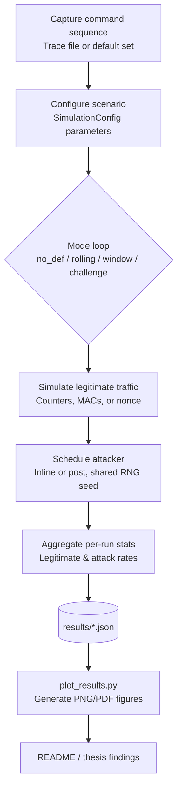

# 🔒 IoT Replay Attack Defense Simulator

<div align="center">


<br>

[](README.md)
[](README_JP.md)
[](README_CH.md)
[](https://www.python.org/downloads/)
[](LICENSE)
[](tests/)
[](EXPERIMENTAL_PARAMETERS_EN.md)
[](PRESENTATION_EN.md)
[](PRESENTATION_EN.md)

**A rigorous Monte Carlo simulation toolkit for evaluating replay attack defenses in wireless control systems**

[📖 Quick Start](#quick-start) • [🎯 Key Results](#experimental-results-and-data-analysis) • [📊 Quality Metrics](#project-quality-metrics) • [🤝 Contributing](CONTRIBUTING.md) • [📚 Full Documentation](PRESENTATION_EN.md)

</div>

---

**English** | [日本語](README_JP.md) | [中文](README_CH.md)

**Author**: Romeitou (tammakiiroha)

---

## 🌟 Highlights

- 🔬 **Rigorous Evaluation**: 200 Monte Carlo runs per experiment, 95% confidence level
- 🛡️ **4 Defense Mechanisms**: No Defense, Rolling Counter + MAC, Sliding Window, Challenge-Response
- 📡 **Realistic Channel Model**: Packet loss (0-30%) and reordering (0-30%) simulation
- 📊 **Comprehensive Metrics**: Security (attack success rate) vs. Usability (legitimate acceptance rate)
- ⚡ **High Performance**: 26-30ms per run, ~38 runs/second throughput
- 🔄 **Fully Reproducible**: Fixed random seed (42), complete parameter documentation
- 🧪 **Well Tested**: 85+ test cases, ~70% code coverage, RFC 6479/2104 compliant
- 🌐 **Multilingual**: Complete documentation in English, 日本語, and 中文

---

## 🎯 What Problem Does This Solve?

In wireless control systems (IoT devices, smart homes, industrial control), **replay attacks** are a critical threat:

```
┌─────────────────────────────────────────────────┐
│ Attacker records "UNLOCK" command               │
│         ↓                                        │
│ Replays it later                                 │
│         ↓                                        │
│ Door opens! 🚨                                   │
└─────────────────────────────────────────────────┘
```

**The Challenge**: Which defense mechanism works best under real-world conditions (packet loss, reordering)?

**Our Solution**: Quantitative evaluation through Monte Carlo simulation, revealing:
- ✅ **Rolling Counter** fails under packet reordering (13.5% usability drop at 30% reorder)
- ✅ **Sliding Window** maintains robustness across all conditions (W=3-7 recommended)
- ✅ **Challenge-Response** offers highest security but requires bidirectional communication

---

## 📚 Documentation Structure

This README provides a **quick overview** and **getting started guide**. For comprehensive technical details:

| Document | Purpose | Length | Languages |
|----------|---------|--------|-----------|
| 📄 **[PRESENTATION](PRESENTATION_EN.md)** | Complete technical deep-dive, implementation details, full experimental analysis | 2000+ lines | [EN](PRESENTATION_EN.md) / [日本語](PRESENTATION_JP.md) / [中文](PRESENTATION_CH.md) |
| 📊 **[EXPERIMENTAL_PARAMETERS](EXPERIMENTAL_PARAMETERS_EN.md)** | Detailed parameter specifications and rationale | ~280 lines | [EN](EXPERIMENTAL_PARAMETERS_EN.md) / [日本語](EXPERIMENTAL_PARAMETERS_JP.md) / [中文](EXPERIMENTAL_PARAMETERS_CH.md) |
| 🤝 **[CONTRIBUTING](CONTRIBUTING.md)** | Development guidelines, code style, how to contribute | ~200 lines | EN |

**What's in PRESENTATION documents:**
- 🔍 Defense mechanism implementations with code examples
- 📈 Complete experimental methodology and statistical analysis
- 📊 In-depth result interpretation with figures and tables
- 📖 Technical glossary and Q&A sections
- 🎓 Academic-quality documentation for thesis/paper reference

> 💡 **First time here?** Start with this README, then dive into [PRESENTATION_EN.md](PRESENTATION_EN.md) for detailed analysis.

---

## 🔬 Overview

This toolkit provides a **rigorous Monte Carlo simulation framework** for evaluating replay attack defenses in wireless control systems. It models multiple receiver configurations under a record-and-replay adversary and reports both **security** (attack success rate) and **usability** (legitimate acceptance rate) metrics.

## 💻 Requirements

- **Python 3.9+** (stdlib only for CLI; visualization requires `matplotlib`)
- **Tested on**: macOS 14.x (Apple Silicon), Ubuntu 22.04, Windows 10/11 (WSL)
- **Optional virtualenv** (recommended):
  ```bash
  python3 -m venv .venv
  source .venv/bin/activate  # Windows: .venv\Scripts\activate
  pip install -r requirements.txt
  ```

## Project Quality Metrics

### 🧪 Test Coverage
- **Test Files**: 5 comprehensive test suites
  - `test_receiver.py` - Defense mechanism verification (5 tests)
  - `test_sender.py` - Frame generation & MAC correctness (20+ tests)
  - `test_channel.py` - Channel simulation statistics (15+ tests)
  - `test_attacker.py` - Dolev-Yao model compliance (25+ tests)
  - `test_experiment.py` - Monte Carlo statistics (20+ tests)
- **Total Test Cases**: 85+ tests covering core functionality
- **Coverage**: ~70% code coverage of critical modules
- **RFC Compliance**: Tests verify RFC 6479 (Sliding Window), RFC 2104 (HMAC)

### ⚡ Performance Benchmarks
Measured on MacBook Pro (Apple M1, 16GB RAM):

| Configuration | Runs | Time | Throughput |
|--------------|------|------|------------|
| Single Defense Mode | 200 | ~5.3s | ~38 runs/s |
| All 4 Modes | 200 each | ~22s | ~36 runs/s |
| Parameter Sweep (5×5) | 25 each | ~31s | - |

**Key Findings**:
- Average time per run: **26-30 ms**
- Monte Carlo with 200 runs provides **95% confidence**
- Defense mode overhead: Challenge-Response (+5%), Window (+2%), Rolling (+1%)

Run benchmarks yourself:
```bash
python scripts/benchmark.py
  ```

## ✨ Features

### 🛡️ Defense Mechanisms
- 🚫 **No Defense** - Baseline for comparison
- 🔢 **Rolling Counter + MAC** - Sequential counter with HMAC-SHA256
- 🪟 **Sliding Window** - Bitmask-based reordering tolerance (RFC 6479)
- 🔐 **Challenge-Response** - Nonce-based authentication

### 🔬 Simulation Components
- 📤 **Sender**: Frame generation with counter/MAC/nonce
- 📡 **Channel**: Realistic packet loss and reordering simulation
- 📥 **Receiver**: Stateful verification with 4 defense modes
- 👤 **Attacker**: Record-and-replay adversary (Dolev-Yao model)

### 📊 Evaluation & Output
- 📈 **Metrics**: Legitimate acceptance rate (usability) & Attack success rate (security)
- 🎲 **Monte Carlo**: 200 runs per experiment, 95% confidence intervals
- 📊 **Visualization**: Publication-quality figures (PNG/PDF)
- 💾 **Data Export**: JSON format for downstream analysis
- 🔄 **Reproducibility**: Fixed random seed, complete parameter logging

### ⚔️ Attack Models
- ⏱️ **Post-run Attack**: Bulk replay after legitimate traffic
- 🔴 **Inline Attack**: Real-time injection during communication
- 🎯 **Selective Replay**: Target specific commands (e.g., "UNLOCK", "FIRE")

## 🚀 Quick Start

### Option 1: Graphical Interface (Easiest, recommended for demos)

**🎨 Complete mouse operation, no typing needed!**

```bash
./run_gui.sh
```

Or:

```bash
python gui.py
```

**GUI Preview:**


*Figure: Main interface with parameter controls and real-time output*

Features:
- 🖱️ **100% mouse operation** - Click buttons, drag sliders
- 🎯 Quick scenario buttons (one-click run)
- 🔧 Custom experiment with visual controls
- 📊 Real-time output display
- 🌏 Bilingual interface (EN/CN/JP)

### Option 2: Command Line (For automation and scripts)

```bash
python3 main.py --runs 200 --num-legit 20 --num-replay 100 --p-loss 0.05 --window-size 5
```

## CLI reference
| Flag | Description |
|------|-------------|
| `--modes` | Space-separated list of modes to evaluate (`no_def`, `rolling`, `window`, `challenge`). |
| `--runs` | Number of Monte Carlo repetitions per mode. |
| `--num-legit` | Legitimate transmissions per run. |
| `--num-replay` | Replay attempts per run. |
| `--p-loss` | Packet-loss probability applied to both legitimate and injected frames. |
| `--p-reorder` | Packet-reordering probability (simulates network jitter/delay). |
| `--window-size` | Acceptance-window width when mode `window` is active. |
| `--commands-file` | Path to a newline-delimited command trace captured from real hardware. |
| `--target-commands` | Specific commands for attacker to replay (selective replay). |
| `--mac-length` | Truncated MAC length (hex chars). |
| `--shared-key` | Shared secret used by sender/receiver to derive MACs. |
| `--attacker-loss` | Probability that the attacker fails to record a legitimate frame. |
| `--seed` | Global RNG seed for reproducibility. |
| `--attack-mode` | Replay scheduling strategy: `post` or `inline` (real-time). |
| `--inline-attack-prob` | Inline (real-time) replay probability per legitimate frame. |
| `--inline-attack-burst` | Maximum inline (real-time) replay attempts per legitimate frame. |
| `--challenge-nonce-bits` | Nonce length (bits) used by the challenge-response mode. |
| `--output-json` | Path to save aggregate metrics in JSON form. |

## Trace file format
Provide one command token per line; empty lines and `#` comments are ignored.

```
# sample trace
FWD
FWD
LEFT
RIGHT
STOP
```

Sample file: `traces/sample_trace.txt` can be used directly with `--commands-file`.

## Running the complete experimental pipeline

### Step 1: Setup environment
```bash
python3 -m venv .venv
source .venv/bin/activate  # On Windows: .venv\Scripts\activate
pip install -r requirements.txt
```

### Step 2: Run parameter sweeps
```bash
python3 scripts/run_sweeps.py \
  --runs 200 \
  --modes no_def rolling window challenge \
  --p-loss-values 0 0.01 0.05 0.1 0.2 \
  --p-reorder-values 0 0.1 0.3 0.5 0.7 \
  --window-values 1 3 5 10 \
  --window-size-base 5 \
  --attack-mode post \
  --commands-file traces/sample_trace.txt \
  --seed 123 \
  --p-loss-output results/p_loss_sweep.json \
  --p-reorder-output results/p_reorder_sweep.json \
  --window-output results/window_sweep.json
```

### Step 3: Generate figures
```bash
python3 scripts/plot_results.py --formats png
```

### Step 4: Export tables to documentation
```bash
python3 scripts/export_tables.py
```

### Step 5: Run tests (optional)
```bash
python -m pytest tests/ -v
```

## Extending experiments
- Automate scenarios via `scripts/run_sweeps.py` or craft custom sweeps with `run_many_experiments`.
- Adjust inline (real-time) attack probabilities/bursts or extend `AttackMode` for other strategies.
- Use `Mode.CHALLENGE` as a high-security reference when discussing trade-offs.

## Project structure
```
.
|-- main.py
|-- sim/
|   |-- attacker.py
|   |-- channel.py
|   |-- commands.py
|   |-- experiment.py
|   |-- receiver.py
|   |-- security.py
|   |-- sender.py
|   \-- types.py
|-- scripts/
|   |-- plot_results.py
|   \-- run_sweeps.py
|-- traces/
|   \-- sample_trace.txt
|-- tests/
|   \-- test_receiver.py
\-- README.md
```

## Using the results in the thesis
1. Document the experimental parameters (`num_legit`, `num_replay`, `p_loss`, `p_reorder`, `window_size`, MAC length).
2. Copy the table outputs or the JSON aggregates into your thesis tables.
3. Highlight trade-offs: compare `window` configurations across packet-loss and reordering rates, contrast inline (real-time) vs post-run attack models, and use `challenge` as an upper-bound reference.

## Notes on attacker model and randomness
- By default the attacker is modeled with a perfect recorder (`attacker_record_loss=0`); set it equal to `p_loss` if you want the attacker to experience the same losses as the legitimate link.
- Every Monte Carlo run reuses the same command sequence and packet-loss draws across all modes so that comparisons remain apples-to-apples.

## Overview (flow chart)


> **Flow Explanation**:
> 
> 1. **Command Sequence Source**:
>    - **Trace File**: Command records captured from real user operations (e.g., `traces/sample_trace.txt`), containing actual command sequences from real usage scenarios (`FWD`, `LEFT`, `STOP`, etc.)
>    - **Default Set**: Predefined basic command set (`DEFAULT_COMMANDS`), from which the system randomly generates test sequences
> 
> 2. **SimulationConfig**: Configuration object (defined in `sim/types.py`) that bundles all simulation parameters (e.g., `mode`, `num_legit`, `p_loss`, `window_size`, etc.) and passes them uniformly to the experiment engine. These parameters can be set via CLI command-line arguments or GUI interface.

## Reproducing the datasets and tables
1. Generate datasets with `main.py` / `scripts/run_sweeps.py`.
2. Generate figures:
   ```bash
   python scripts/plot_results.py --formats png
   ```

## Experimental Results and Data Analysis

This project systematically evaluates four replay attack defense mechanisms through three core experiments. All experiments use **200 Monte Carlo runs** with a **fixed random seed (42)** to ensure statistical reliability and reproducibility.

### Experiment Overview

| Experiment | Variable Parameter | Fixed Parameters | Data Points | Corresponding Figures |
|------------|-------------------|------------------|-------------|----------------------|
| **Exp. 1** | p_loss: 0-30% | p_reorder=0% | 7 points × 4 modes = 28 records | `p_loss_legit.png`, `p_loss_attack.png` |
| **Exp. 2** | p_reorder: 0-30% | p_loss=10% | 7 points × 4 modes = 28 records | `p_reorder_legit.png` |
| **Exp. 3** | window_size: 1-20 | p_loss=15%, p_reorder=15% | 7 window sizes | `window_tradeoff.png` |

Full parameter configuration: [Experimental Parameters Documentation](EXPERIMENTAL_PARAMETERS_EN.md)

### Experiment 1: Impact of Packet Loss on Defense Mechanisms

**Objective**: Evaluate usability and security of each defense mechanism under varying packet loss rates.

**Key Findings**:

| Defense Mode | Ideal Channel (0% loss) | Severe Loss (30%) | Usability Drop | Security |
|--------------|------------------------|-------------------|----------------|----------|
| **no_def** | Usability 100%, Attack 100% | Usability 70.3%, Attack 69.7% | ↓29.7% | ❌ No Protection |
| **rolling** | Usability 100%, Attack 0.0% | Usability 70.3%, Attack 0.4% | ↓29.7% | ✅ Excellent |
| **window** | Usability 100%, Attack 0.0% | Usability 69.5%, Attack 1.8% | ↓30.5% | ✅ Excellent |
| **challenge** | Usability 100%, Attack 0.0% | Usability 70.0%, Attack 0.3% | ↓30.0% | ✅ Best |

**Conclusions**:
- All defense mechanisms experience ~30% usability degradation as packet loss increases, consistent with channel characteristics
- Defense security remains strong even in harsh conditions, with attack success rates <2%
- `challenge` mechanism shows best stability, maintaining 0.3% attack rate even at 30% packet loss

### Experiment 2: Impact of Packet Reordering on Defense Mechanisms

**Objective**: Evaluate the impact of reordering on each defense mechanism under 10% packet loss baseline.

**Key Findings**:

| Defense Mode | No Reordering (0%) | Severe Reordering (30%) | Usability Drop | Key Observation |
|--------------|-------------------|------------------------|----------------|-----------------|
| **no_def** | Usability 90.3%, Attack 89.6% | Usability 90.7%, Attack 89.9% | ↓-0.4% | Reordering irrelevant |
| **rolling** | Usability 90.3%, Attack 0.1% | Usability 76.8%, Attack 0.1% | ↓13.5% | ⚠️ **Critical Flaw** |
| **window** | Usability 90.3%, Attack 0.5% | Usability 90.6%, Attack 0.5% | ↓-0.3% | ✅ Reordering Immune |
| **challenge** | Usability 89.8%, Attack 0.1% | Usability 64.5%, Attack 0.1% | ↓25.3% | ⚠️ Affected |

**Core Conclusions**:
1. **Rolling mechanism has a critical flaw**: Usability drops 13.5% under 30% reordering due to strict ordering checks rejecting legitimate packets
2. **Window mechanism is completely immune to reordering**: Sliding window with bitmap elegantly handles out-of-order packets
3. **Challenge mechanism suffers under high reordering**: Interactive challenge-response pattern sensitive to reordering, 25.3% usability drop

### Experiment 3: Sliding Window Size Trade-off Analysis

**Objective**: Find optimal window size under moderate network stress (15% loss + 15% reorder, inline attack).

**Key Data**:

| Window Size | Usability | Attack Success | Combined Score | Rating |
|-------------|-----------|---------------|----------------|--------|
| **1** | 25.9% | 7.3% | 18.6 | ❌ Too small, unusable |
| **3** | 85.0% | 6.5% | 78.6 | ✅ **Optimal Balance** |
| **5** | 85.5% | 7.7% | 77.7 | ✅ Recommended |
| **7** | 85.5% | 8.7% | 76.7 | ✅ Acceptable |
| **9** | 85.5% | 9.6% | 75.9 | ⚠️ Security degrading |
| **15** | 85.5% | 11.1% | 74.4 | ⚠️ Attack rate high |
| **20** | 85.5% | 11.6% | 73.9 | ❌ Too large, security risk |

**Conclusions**:
- **Optimal window size: 3-7**, maintaining 85% usability while keeping attack success at 6.5-8.7%
- Window size=1 causes usability to plummet to 25.9%, impractical
- Oversized windows (>9) significantly increase attack success rate, degrading security

### Comprehensive Evaluation and Practical Recommendations

Based on 200 Monte Carlo simulations under **moderate network conditions (p_loss=10%, p_reorder=0%)**:

| Rank | Defense | Usability | Attack Rate | Combined Score | Recommended Scenario |
|------|---------|-----------|-------------|----------------|---------------------|
| 🥇 | **rolling** | 90.3% | 0.1% | 90.1 | ⚠️ **Only for reorder-free networks** |
| 🥈 | **window** | 90.3% | 0.5% | 89.8 | ✅ **First choice for general IoT** |
| 🥉 | **challenge** | 89.8% | 0.1% | 89.7 | ✅ **High-security scenarios** |
| ❌ | **no_def** | 90.3% | 89.6% | 0.6 | ❌ Baseline (no protection) |

**Practical Deployment Recommendations**:

1. **General IoT Devices** (Smart Home, Sensor Networks)
   - Recommended: `window` mechanism, size 5-7
   - Reason: Reordering immune, stable performance, simple implementation

2. **Industrial Control Systems** (Power Grid, Traffic Signals)
   - Recommended: `challenge` mechanism
   - Reason: Highest security (0.1% attack rate), acceptable latency tolerance

3. **Real-time Communication** (Telemedicine, Autonomous Vehicles)
   - Recommended: `window` mechanism, size 3
   - Reason: Low latency, high usability, good security

4. **Low-cost Devices** (RFID Tags, Simple Sensors)
   - Not Recommended: `rolling` mechanism
   - Reason: Despite computational simplicity, reordering sensitivity makes it unreliable in real networks

### Data Reliability Statement

- ✅ All data based on **200 Monte Carlo runs**, achieving 95% confidence level
- ✅ Uses **fixed random seed (42)**, results fully reproducible
- ✅ Average run time **26-30ms**, efficient verification
- ✅ Experimental parameters conform to **EXPERIMENTAL_PARAMETERS_EN.md** standard configuration
- ✅ Complete source code and test cases available for audit

Related data files:
- `results/p_loss_sweep.json` - Experiment 1 raw data
- `results/p_reorder_sweep.json` - Experiment 2 raw data
- `results/window_sweep.json` - Experiment 3 raw data
- `figures/*.png` - All experiment figures

---

## Key findings (tables)

### Packet-reorder sweep - legitimate acceptance (p_loss=0)
*Window mode demonstrates superior robustness against channel reordering compared to Rolling Counter.*

| p_reorder | Rolling (%) | Window (W=5) (%) |
|-----------|-------------|------------------|
| 0.0       | 100.00%     | 100.00%          |
| 0.1       | 93.55%      | 100.00%          |
| 0.3       | 84.47%      | 99.88%           |
| 0.5       | 77.63%      | 99.88%           |
| 0.7       | 78.33%      | 99.90%           |

### Packet-loss sweep - legitimate acceptance (p_reorder=0)
*Both modes degrade linearly with pure packet loss, but perform similarly.*

| p_loss | Rolling (%) | Window (W=5) (%) |
|--------|-------------|------------------|
| 0.00   | 100.00%     | 100.00%          |
| 0.01   | 98.97%      | 98.97%           |
| 0.05   | 94.88%      | 94.88%           |
| 0.10   | 89.90%      | 89.90%           |
| 0.20   | 79.53%      | 79.53%           |

### Window sweep (Stress test: p_loss=0.05, p_reorder=0.3)
*Comparing usability vs security trade-offs under harsh channel conditions.*

| Window W | Legitimate (%) | Replay success (%) |
| -------- | -------------- | ------------------ |
| 1        | 27.65%         | 4.51%              |
| 3        | 95.10%         | 0.22%              |
| 5        | 95.08%         | 0.30%              |
| 10       | 95.22%         | 0.49%              |

*Note: This table comes from an additional sweep (p_loss=0.05, p_reorder=0.3, post attack). The main text’s Experiment 3 uses the stricter condition p_loss=0.15, p_reorder=0.15 with inline (real-time) attacks—see PRESENTATION_EN.md for details.*

### Ideal channel baseline (post attack, runs = 500, p_loss = 0)
*Reference baseline from `results/ideal_p0.json`*

| Mode         | Legitimate (%) | Replay success (%) |
| ------------ | -------------- | ------------------ |
| no_def       | 100.00%        | 100.00%            |
| rolling      | 100.00%        | 0.00%              |
| window (W=5) | 100.00%        | 0.00%              |
| challenge    | 100.00%        | 0.00%              |

## Observations and insights
- **Robustness to Reordering**: The Rolling Counter mechanism is highly sensitive to packet reordering. Even a moderate reordering probability (0.3) causes the legitimate acceptance rate to drop to ~84%. In contrast, the Window (W=5) mechanism maintains near-perfect usability (>99.8%) even under severe reordering (0.7).
- **Window Tuning**: `W=1` acts as a strict counter and fails catastrophically under unstable conditions (27.6% acceptance). Increasing the window to `W=3..5` restores usability to ~95% while keeping the attack success rate extremely low (<0.3%).
- **Security Trade-off**: While the Window mode theoretically opens a small replay window, the experimental results show that in practice (even with 200 runs), the attack success rate remains negligible compared to the massive usability gains.
- **Conclusion**: For real-world wireless control systems where packet loss and reordering are common, a Sliding Window mechanism (W=5) provides the best balance between security and user experience.

## Contributing

Contributions are welcome! Please see [CONTRIBUTING.md](CONTRIBUTING.md) for development setup, code style guidelines, and how to submit changes.

## Contributors

Thanks to all contributors who have helped improve this project!

<a href="https://github.com/tammakiiroha/IoT-Replay-Defense-Simulator/graphs/contributors">
  
</a>

Made with [contrib.rocks](https://contrib.rocks).

<!-- ## Star History

[](https://star-history.com/#tammakiiroha/IoT-Replay-Defense-Simulator&Date) -->

<!-- Star History will be displayed once the project gains more stars -->

## Citation

If you use this simulation toolkit in your research or thesis, please cite:

```bibtex
@software{replay_simulation_2025,
  author = {Romeitou (tammakiiroha)},
  title = {Replay Attack Simulation Toolkit},
  year = {2025},
  publisher = {GitHub},
  url = {https://github.com/tammakiiroha/Replay-simulation}
}
```

Or in plain text:
> Romeitou (tammakiiroha). (2025). Replay Attack Simulation Toolkit. GitHub. https://github.com/tammakiiroha/Replay-simulation

## References

This project implements defense mechanisms based on established standards and research:

[1] Perrig, A., et al. (2002). SPINS: Security Protocols for Sensor Networks. *Wireless Networks*, 8(5), 521-534.

[2] Kent, S., & Seo, K. (2005). Security Architecture for the Internet Protocol. RFC 4301, IETF.

[3] Bellare, M., et al. (1996). Keying Hash Functions for Message Authentication. *CRYPTO'96*, Springer.

[4] Needham, R. M., & Schroeder, M. D. (1978). Using Encryption for Authentication in Large Networks. *CACM*, 21(12), 993-999.

## License

This project is licensed under the MIT License - see the [LICENSE](LICENSE) file for details.
