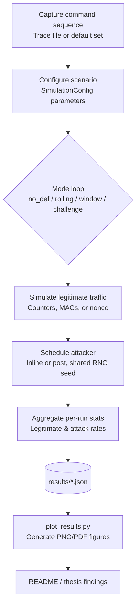

# 🔒 IoT Replay Attack Defense Simulator

<div align="center">


<br>

[](README.md)
[](README_JP.md)
[](README_CH.md)
[](https://www.python.org/downloads/)
[](LICENSE)
[](tests/)
[](EXPERIMENTAL_PARAMETERS_EN.md)

**A Monte Carlo–based simulator for evaluating replay attack defense mechanisms in 2.4 GHz wireless control systems (graduation thesis research tool)**

[📖 Quick Start](#quick-start) • [🎯 Key Results](#experimental-results-and-data-analysis) • [📊 Quality & Tests](#project-quality-and-tests) • [🤝 Contributing](CONTRIBUTING.md) • [📚 Full Documentation](PRESENTATION_EN.md)

</div>

---

**English** | [日本語](README_JP.md) | [中文](README_CH.md)

**Author**: Romeitou (tammakiiroha)

> For detailed authorship declaration and development background, see [AUTHORSHIP.md](AUTHORSHIP.md).

---

## 🌟 Highlights

- 🔬 **Monte Carlo Evaluation**: 200 simulation runs per experiment for stable statistics
- 🛡️ **4 Defense Mechanisms**: No Defense, Rolling Counter + MAC, Sliding Window, Challenge-Response
- 📡 **Simplified Channel Model**: Approximates wireless environments with packet loss (0–30%) and reordering (0–30%)
- 📊 **Clear Metrics**: Security (attack success rate) vs. usability (legitimate acceptance rate)
- ⚡ **Fast Enough for Experiments**: Runs complete in a few seconds for typical configurations on a laptop-class machine
- 🔄 **Reproducible**: Fixed random seed and documented parameter sets
- 🧪 **Well Tested**: 94 unit tests covering sender, receiver, channel, attacker, and experiment logic
- 🌐 **Multilingual**: Documentation in English, 日本語, and 中文

---

## 🎯 What Problem Does This Solve?

In wireless control systems (IoT devices, smart homes, industrial control), **replay attacks** are a critical threat:

```
┌─────────────────────────────────────────────────┐
│ Attacker records "UNLOCK" command               │
│         ↓                                        │
│ Replays it later                                 │
│         ↓                                        │
│ Door opens! 🚨                                   │
└─────────────────────────────────────────────────┘
```

**The Challenge**: Which defense mechanism works best under real-world conditions (packet loss, reordering)?

**Our Solution**: Quantitative evaluation through Monte Carlo simulation, revealing:
- ✅ **Rolling Counter** fails under packet reordering (13.5% usability drop at 30% reorder)
- ✅ **Sliding Window** maintains robustness across all conditions (W=3-7 recommended)
- ✅ **Challenge-Response** offers highest security but requires bidirectional communication

---

## 📚 Documentation Structure

This README provides a **quick overview** and **getting started guide**. For comprehensive technical details:

| Document | Purpose | Length | Languages |
|----------|---------|--------|-----------|
| 📄 **[PRESENTATION](PRESENTATION_EN.md)** | Complete technical deep-dive, implementation details, full experimental analysis | 2000+ lines | [EN](PRESENTATION_EN.md) / [日本語](PRESENTATION_JP.md) / [中文](PRESENTATION_CH.md) |
| 📊 **[EXPERIMENTAL_PARAMETERS](EXPERIMENTAL_PARAMETERS_EN.md)** | Detailed parameter specifications and rationale | ~280 lines | [EN](EXPERIMENTAL_PARAMETERS_EN.md) / [日本語](EXPERIMENTAL_PARAMETERS_JP.md) / [中文](EXPERIMENTAL_PARAMETERS_CH.md) |
| 🤝 **[CONTRIBUTING](CONTRIBUTING.md)** | Development guidelines, code style, how to contribute | ~200 lines | EN |

**What's in PRESENTATION documents:**
- 🔍 Defense mechanism implementations with code examples
- 📈 Complete experimental methodology and statistical analysis
- 📊 In-depth result interpretation with figures and tables
- 📖 Technical glossary and Q&A sections
- 🎓 Academic-quality documentation for thesis/paper reference

> 💡 **First time here?** Start with this README, then dive into [PRESENTATION_EN.md](PRESENTATION_EN.md) for detailed analysis.

---

## 🔬 Overview

This toolkit provides a **Monte Carlo–based simulation framework** for evaluating replay attack defenses in wireless control systems. It models multiple receiver configurations under a record-and-replay adversary and reports both **security** (attack success rate) and **usability** (legitimate acceptance rate) metrics.

## 💻 Requirements

- **Python 3.9+** (stdlib only for CLI; visualization requires `matplotlib`)
- **Tested on**: macOS 14.x (Apple Silicon), Ubuntu 22.04, Windows 10/11 (WSL)
- **Optional virtualenv** (recommended):
  ```bash
  python3 -m venv .venv
  source .venv/bin/activate  # Windows: .venv\Scripts\activate
  pip install -r requirements.txt
  ```

## Project Quality and Tests

### 🧪 Tests

This repository includes unit tests for all core simulation components:

- `test_receiver.py` – defense mechanism behavior
- `test_sender.py` – frame generation and MAC calculation
- `test_channel.py` – packet loss / reordering statistics
- `test_attacker.py` – replay attacker behavior
- `test_experiment.py` – Monte Carlo experiment driver

In total there are 94 test cases covering sender, receiver, channel, attacker, and experiment logic.

You can run all tests with:

```bash
pytest
```

Sliding-window behavior is designed with RFC 6479 as a reference, and HMAC results are checked against RFC 2104 test vectors, but this simulator is not intended to be a full standards-compliant implementation.

### ⚡ Performance (indicative)

On a laptop-class machine (e.g., Apple M1 with Python 3.11), a typical configuration with 200 runs per mode finishes in a few seconds. The goal of this project is research evaluation, so performance is tuned to be "fast enough" for parameter sweeps and repeated experiments, rather than to provide precise benchmarking numbers.

## ✨ Features

### 🛡️ Defense Mechanisms
- 🚫 **No Defense** - Baseline for comparison
- 🔢 **Rolling Counter + MAC** - Sequential counter with HMAC-SHA256
- 🪟 **Sliding Window** - Bitmask-based reordering tolerance (RFC 6479)
- 🔐 **Challenge-Response** - Nonce-based authentication

### 🔬 Simulation Components
- 📤 **Sender**: Frame generation with counter/MAC/nonce
- 📡 **Channel**: Realistic packet loss and reordering simulation
- 📥 **Receiver**: Stateful verification with 4 defense modes
- 👤 **Attacker**: Record-and-replay adversary

### 📊 Evaluation & Output
- 📈 **Metrics**: Legitimate acceptance rate (usability) & Attack success rate (security)
- 🎲 **Monte Carlo**: 200 runs per experiment for stable estimates
- 📊 **Visualization**: Publication-quality figures (PNG/PDF)
- 💾 **Data Export**: JSON format for downstream analysis
- 🔄 **Reproducibility**: Fixed random seed, complete parameter logging

### ⚔️ Attack Models
- ⏱️ **Post-run Attack**: Bulk replay after legitimate traffic
- 🔴 **Inline Attack**: Real-time injection during communication
- 🎯 **Selective Replay**: Target specific commands (e.g., "UNLOCK", "FIRE")

## Threat Model and Assumptions

**Adversary capabilities**

- Can passively eavesdrop on all wireless frames on the channel
- Can record any observed frame without loss (ideal recorder)
- Can later inject previously recorded frames at arbitrary times (post-run bulk replay or inline real-time injection)
- Can selectively replay only specific commands (e.g., "UNLOCK", "FIRE")

**Adversary limitations**

- Cannot forge valid MACs without the shared secret key
- Does not break cryptographic primitives (HMAC-SHA256 is assumed secure)
- Does not perform lower-layer attacks such as jamming, RF fingerprint spoofing, or precise timing manipulation

**Channel assumptions**

- Packet loss is modeled as an independent Bernoulli process with probability `p_loss`
- Packet reordering is modeled as an independent event with probability `p_reorder`
- Detailed physical-layer effects (fading, multipath, burst loss, time correlation) are **not** modeled

**Scope**

The simulator focuses on the logical behavior of the defense mechanisms and the security–usability trade-off under the above assumptions. Physical-layer details, hardware constraints, and energy consumption are considered out of scope.

---

## Quick Start

### Option 1: Graphical Interface (Easiest, recommended for demos)

**🎨 Complete mouse operation, no typing needed!**

```bash
./run_gui.sh
```

Or:

```bash
python gui.py
```

**GUI Preview:**


*Figure: Main interface with parameter controls and real-time output*

Features:
- 🖱️ **100% mouse operation** - Click buttons, drag sliders
- 🎯 Quick scenario buttons (one-click run)
- 🔧 Custom experiment with visual controls
- 📊 Real-time output display
- 🌏 Bilingual interface (EN/CN/JP)

### Option 2: Command Line (For automation and scripts)

```bash
python3 main.py --runs 200 --num-legit 20 --num-replay 100 --p-loss 0.05 --window-size 5
```

## CLI reference
| Flag | Description |
|------|-------------|
| `--modes` | Space-separated list of modes to evaluate (`no_def`, `rolling`, `window`, `challenge`). |
| `--runs` | Number of Monte Carlo repetitions per mode. |
| `--num-legit` | Legitimate transmissions per run. |
| `--num-replay` | Replay attempts per run. |
| `--p-loss` | Packet-loss probability applied to both legitimate and injected frames. |
| `--p-reorder` | Packet-reordering probability (simulates network jitter/delay). |
| `--window-size` | Acceptance-window width when mode `window` is active. |
| `--commands-file` | Path to a newline-delimited command trace captured from real hardware. |
| `--target-commands` | Specific commands for attacker to replay (selective replay). |
| `--mac-length` | Truncated MAC length (hex chars). |
| `--shared-key` | Shared secret used by sender/receiver to derive MACs. |
| `--attacker-loss` | Probability that the attacker fails to record a legitimate frame. |
| `--seed` | Global RNG seed for reproducibility. |
| `--attack-mode` | Replay scheduling strategy: `post` or `inline` (real-time). |
| `--inline-attack-prob` | Inline (real-time) replay probability per legitimate frame. |
| `--inline-attack-burst` | Maximum inline (real-time) replay attempts per legitimate frame. |
| `--challenge-nonce-bits` | Nonce length (bits) used by the challenge-response mode. |
| `--output-json` | Path to save aggregate metrics in JSON form. |

## Trace file format
Provide one command token per line; empty lines and `#` comments are ignored.

```
# sample trace
FWD
FWD
LEFT
RIGHT
STOP
```

Sample file: `traces/sample_trace.txt` can be used directly with `--commands-file`.

## Running the complete experimental pipeline

### Step 1: Setup environment
```bash
python3 -m venv .venv
source .venv/bin/activate  # On Windows: .venv\Scripts\activate
pip install -r requirements.txt
```

### Step 2: Run parameter sweeps
```bash
python3 scripts/run_sweeps.py \
  --runs 200 \
  --modes no_def rolling window challenge \
  --p-loss-values 0 0.01 0.05 0.1 0.2 \
  --p-reorder-values 0 0.1 0.3 0.5 0.7 \
  --window-values 1 3 5 10 \
  --window-size-base 5 \
  --attack-mode post \
  --commands-file traces/sample_trace.txt \
  --seed 123 \
  --p-loss-output results/p_loss_sweep.json \
  --p-reorder-output results/p_reorder_sweep.json \
  --window-output results/window_sweep.json
```

### Step 3: Generate figures
```bash
python3 scripts/plot_results.py --formats png
```

### Step 4: Export tables to documentation
```bash
python3 scripts/export_tables.py
```

### Step 5: Run tests (optional)
```bash
python -m pytest tests/ -v
```

## Extending experiments
- Automate scenarios via `scripts/run_sweeps.py` or craft custom sweeps with `run_many_experiments`.
- Adjust inline (real-time) attack probabilities/bursts or extend `AttackMode` for other strategies.
- Use `Mode.CHALLENGE` as a high-security reference when discussing trade-offs.

## Project structure
```
.
|-- main.py
|-- sim/
|   |-- attacker.py
|   |-- channel.py
|   |-- commands.py
|   |-- experiment.py
|   |-- receiver.py
|   |-- security.py
|   |-- sender.py
|   \-- types.py
|-- scripts/
|   |-- plot_results.py
|   \-- run_sweeps.py
|-- traces/
|   \-- sample_trace.txt
|-- tests/
|   \-- test_receiver.py
\-- README.md
```

## Using the results in the thesis
1. Document the experimental parameters (`num_legit`, `num_replay`, `p_loss`, `p_reorder`, `window_size`, MAC length).
2. Copy the table outputs or the JSON aggregates into your thesis tables.
3. Highlight trade-offs: compare `window` configurations across packet-loss and reordering rates, contrast inline (real-time) vs post-run attack models, and use `challenge` as an upper-bound reference.

## Notes on attacker model and randomness
- By default the attacker is modeled with a perfect recorder (`attacker_record_loss=0`); set it equal to `p_loss` if you want the attacker to experience the same losses as the legitimate link.
- Every Monte Carlo run reuses the same command sequence and packet-loss draws across all modes so that comparisons remain apples-to-apples.

## Overview (flow chart)


> **Flow Explanation**:
> 
> 1. **Command Sequence Source**:
>    - **Trace File**: Command records captured from real user operations (e.g., `traces/sample_trace.txt`), containing actual command sequences from real usage scenarios (`FWD`, `LEFT`, `STOP`, etc.)
>    - **Default Set**: Predefined basic command set (`DEFAULT_COMMANDS`), from which the system randomly generates test sequences
> 
> 2. **SimulationConfig**: Configuration object (defined in `sim/types.py`) that bundles all simulation parameters (e.g., `mode`, `num_legit`, `p_loss`, `window_size`, etc.) and passes them uniformly to the experiment engine. These parameters can be set via CLI command-line arguments or GUI interface.

## Reproducing the datasets and tables
1. Generate datasets with `main.py` / `scripts/run_sweeps.py`.
2. Generate figures:
   ```bash
   python scripts/plot_results.py --formats png
   ```

## Experimental Results and Data Analysis

This project systematically evaluates four replay attack defense mechanisms through three core experiments. All experiments use **200 Monte Carlo runs** with a **fixed random seed (42)** to ensure statistical reliability and reproducibility.

### Experiment Overview

| Experiment | Variable Parameter | Fixed Parameters | Data Points | Corresponding Figures |
|------------|-------------------|------------------|-------------|----------------------|
| **Exp. 1** | p_loss: 0-30% | p_reorder=0% | 7 points × 4 modes = 28 records | `p_loss_legit.png`, `p_loss_attack.png` |
| **Exp. 2** | p_reorder: 0-30% | p_loss=10% | 7 points × 4 modes = 28 records | `p_reorder_legit.png`, `p_reorder_attack.png` |
| **Exp. 3** | window_size: 1-20 | p_loss=15%, p_reorder=15% | 7 window sizes | `window_tradeoff.png` |

Full parameter configuration: [Experimental Parameters Documentation](EXPERIMENTAL_PARAMETERS_EN.md)

### Experiment 1: Impact of Packet Loss on Defense Mechanisms

**Objective**: Evaluate usability and security of each defense mechanism under varying packet loss rates.

**Key Findings**:

| Defense Mode | Ideal Channel (0% loss) | Severe Loss (30%) | Usability Drop | Security |
|--------------|------------------------|-------------------|----------------|----------|
| **no_def** | Usability 100%, Attack 100% | Usability 70.3%, Attack 69.7% | ↓29.7% | ❌ No Protection |
| **rolling** | Usability 100%, Attack 0.0% | Usability 70.3%, Attack 0.4% | ↓29.7% | ✅ Excellent |
| **window** | Usability 100%, Attack 0.0% | Usability 69.5%, Attack 1.8% | ↓30.5% | ✅ Excellent |
| **challenge** | Usability 100%, Attack 0.0% | Usability 70.0%, Attack 0.3% | ↓30.0% | ✅ Best security under these conditions |

**Conclusions**:
- All defense mechanisms experience ~30% usability degradation as packet loss increases, consistent with channel characteristics
- Defense security remains strong even in harsh conditions, with attack success rates <2%
- Under these experimental conditions, `challenge` mechanism shows best stability, maintaining 0.3% attack rate even at 30% packet loss

**Deep Dive: Why such different attack success rates under the same packet loss?**

| Mechanism | Attack Rate at 30% Loss | Root Cause Analysis |
|-----------|------------------------|---------------------|
| **no_def** | 69.7% | Attack frames also suffer packet loss (100% × 0.7 ≈ 70%), but no verification mechanism to block replays |
| **rolling** | 0.4% | Counter has already incremented, replayed old frame's counter value is outdated and rejected by receiver |
| **window** | 1.8% | Counter is out of window range, and bitmap marks it as used, replay is rejected |
| **challenge** | 0.3% | Each communication uses a new nonce, old frame's response cannot match new challenge |

**Why do the three defense mechanisms have different attack rates (0.3% vs 0.4% vs 1.8%)?**

While all three mechanisms effectively defend against replay attacks, the attack success rates differ, reflecting each mechanism's **design trade-offs**:

| Rank | Mechanism | Attack Rate | Why this value? |
|------|-----------|-------------|-----------------|
| 🥇 | **challenge** | 0.3% | **Theoretically safest in this model**: Each communication uses a completely new nonce (128-bit), unpredictable to attackers. The extremely low success rate comes from statistical noise or extreme edge cases |
| 🥈 | **rolling** | 0.4% | **Strict ordering**: Counter strictly increments, replay frame counter must be outdated. Slightly higher than challenge due to: possible tiny race window when receiver counter "jumps" due to packet loss |
| 🥉 | **window** | 1.8% | **Design compromise**: Opens window range to tolerate reordering. When legitimate frame is lost but counter is still within window and unmarked as used, replay frame can be accepted |

**Root cause of higher attack rate in window mechanism**:

```
Scenario: Window size W=5, current window [10,11,12,13,14]

1. Legitimate frame (counter=11) sent → packet loss → receiver doesn't receive
2. Legitimate frames (counter=12,13,14) received successfully, bitmap [_,_,✓,✓,✓]
3. Attacker replays recorded frame (counter=11)
4. Receiver checks: 11 is within window and unmarked → accepted ❌

This is the design cost of window mechanism's "trading security for usability".
```

**Core Insights**:
- **challenge**: Highest security, but requires bidirectional communication (increased latency and complexity)
- **rolling**: Second highest security, but clearly sensitive to reordering (significant usability drop in Experiment 2)
- **window**: Slightly lower security (1.8%), but highly robust to reordering under these experimental conditions (most stable in Experiment 2)

> 💡 **The Essence of Trade-offs**: There is no perfect solution. Window trades ~1.4% additional attack risk (1.8%-0.4%) for more stable usability under strong reordering conditions, which may be a reasonable choice in many scenarios where usability is important.

### Experiment 2: Impact of Packet Reordering on Defense Mechanisms

**Objective**: Evaluate the impact of reordering on each defense mechanism under 10% packet loss baseline.

**Key Findings**:

| Defense Mode | No Reordering (0%) | Severe Reordering (30%) | Usability Drop | Key Observation |
|--------------|-------------------|------------------------|----------------|-----------------|
| **no_def** | Usability 90.3%, Attack 89.6% | Usability 90.7%, Attack 89.9% | ↓-0.4% | Reordering irrelevant |
| **rolling** | Usability 90.3%, Attack 0.1% | Usability 76.8%, Attack 0.1% | ↓13.5% | ⚠️ **Highly sensitive to reordering** |
| **window** | Usability 90.3%, Attack 0.5% | Usability 90.6%, Attack 0.5% | ↓-0.3% | ✅ Robust to reordering in this experiment |
| **challenge** | Usability 89.8%, Attack 0.1% | Usability 64.5%, Attack 0.1% | ↓25.3% | ⚠️ Affected |

**Core Conclusions**:
1. **Rolling mechanism shows significant issues under reordering**: Usability drops 13.5% under 30% reordering due to strict ordering checks rejecting legitimate packets that arrive late as replays
2. **Window mechanism is highly robust to reordering in this experiment**: Through sliding window and bitmap mechanism, allows any order of arrival within the window, so usability is barely affected at 0-30% reordering
3. **Challenge mechanism suffers under high reordering**: Interactive challenge-response pattern sensitive to reordering, 25.3% usability drop

**Deep Dive: Why does challenge mechanism plummet 25.3% in usability under reordering?**

Challenge-Response mechanism requires **strict bidirectional timing pairing**:

```
Normal flow: Sender ──challenge(N1)──> Receiver ──response(N1)──> Verification passed ✅

Reordering scenario:
  Sender ──challenge(N1)──> [network delay]
  Sender ──challenge(N2)──> Receiver (arrives first)
  Receiver expects N2's response, but receives N1's response ──> Verification failed ❌
```

| Problem | Impact |
|---------|--------|
| **Challenge expiration** | When response arrives, receiver has already issued new challenge, old response rejected |
| **Response mismatch** | Reordering causes response to pair with wrong challenge |
| **Timeout mechanism** | To prevent replay, challenges usually have time limits, reordering easily triggers timeout |

**Comparison with window mechanism**: Window uses **bitmap** to track received counter values, allowing any order of arrival within window range, thus highly robust within the reordering range covered by window size. This embodies the advantage of **unidirectional communication protocols** over **bidirectional handshake protocols** in unstable networks.

### Experiment 3: Sliding Window Size Trade-off Analysis

**Objective**: Find optimal window size under moderate network stress (15% loss + 15% reorder, inline attack).

**Key Data**:

| Window Size | Usability | Attack Success | Combined Score | Rating |
|-------------|-----------|---------------|----------------|--------|
| **1** | 25.9% | 7.3% | 18.6 | ❌ Window too small, extremely poor usability |
| **3** | 85.0% | 6.5% | 78.6 | ✅ **Optimal Balance** |
| **5** | 85.5% | 7.7% | 77.7 | ✅ Recommended |
| **7** | 85.5% | 8.7% | 76.7 | ✅ Acceptable |
| **9** | 85.5% | 9.6% | 75.9 | ⚠️ Security degrading |
| **15** | 85.5% | 11.1% | 74.4 | ⚠️ Attack rate getting high |
| **20** | 85.5% | 11.6% | 73.9 | ❌ Window too large, security risk |

**Conclusions**:
- **Optimal window size: 3-7**, maintaining 85% usability while keeping attack success at 6.5-8.7%
- Window size=1 causes usability to plummet to 25.9%, extremely impractical
- Oversized windows (>9) significantly increase attack success rate, degrading security

**Deep Dive: How to understand W=3 being "optimal" in this experiment?**

Under the experimental conditions (p_loss=15%, p_reorder=15%, inline attack), the combined score reaches its highest value at W=3 (78.6), with W=5 and W=7 slightly lower but very close (77.7 and 76.7 respectively).

| Window Size | Combined Score | Assessment |
|-------------|---------------|------------|
| **W=3** | **78.6** | Slightly superior under these conditions |
| W=5 | 77.7 | Close to W=3 |
| W=7 | 76.7 | Still in good range |

This indicates that **within the W=3-7 range, the window mechanism is in a "high usability + low attack success" optimal zone**, and W=3 is "slightly better" under the current scoring method, but not the only viable choice.

Therefore, a more prudent statement would be:
- **Under these simulation conditions**, W=3-7 forms an "optimal window size range"
- If further determination of the final value is needed, real-device testing of candidates within this range in the target environment is recommended

**Simulation Limitations Explained**:

| Limitation | Description | Potential Impact |
|------------|-------------|------------------|
| **Reordering model** | Uses i.i.d. assumption | Cannot capture bursty reordering in real networks |
| **Attacker model** | Assumes perfect recording capability | Real attackers may have more limitations |
| **Unmodeled factors** | Transmission delay, clock drift, retransmission mechanisms | May affect actual performance |
| **Parameter range** | Only tested specific p_loss/p_reorder combinations | Conclusions may differ under other conditions |

> 💡 **Academic Honesty Statement**: W=3 shows slightly superior performance **under these simulation conditions**. For application to real systems, validation testing of W=3-7 in the target environment is recommended.

### Comprehensive Evaluation and Practical Recommendations

Under this simulation model, based on 200 Monte Carlo runs per configuration under **moderate network conditions (p_loss=10%, p_reorder=0%)**:

| Rank | Defense | Usability | Attack Rate | Combined Score | Recommended Scenario |
|------|---------|-----------|-------------|----------------|---------------------|
| 🥇 | **rolling** | 90.3% | 0.1% | 90.1 | ⚠️ **Better suited for near-reorder-free networks** |
| 🥈 | **window** | 90.3% | 0.5% | 89.8 | ✅ **First choice for general IoT** |
| 🥉 | **challenge** | 89.8% | 0.1% | 89.7 | ✅ **High-security scenarios** |
| ❌ | **no_def** | 90.3% | 89.6% | 0.6 | ❌ Baseline (no protection) |

**⚠️ Notes and Limitations of the "Combined Score" Metric**

The "Combined Score" in the table above uses the simplest calculation method:

```
Combined Score = Usability(%) - Attack Success Rate(%)
```

**This metric has the following limitations that readers should interpret carefully**:

| Issue | Description | More Reasonable Approach |
|-------|-------------|-------------------------|
| **Equal weight assumption** | Implicitly assumes usability and security are equally important (1:1) | Weights should be set based on application scenario, e.g., industrial control should weight security higher |
| **Linear assumption** | Treats 85%→86% as equivalent to 50%→51% | Should consider diminishing marginal utility, improvements in high-usability range are more valuable |
| **No threshold constraints** | No security floor set | In some scenarios, attack rate >1% is unacceptable, should be a hard constraint |
| **Single value** | Compresses multi-dimensional problem to one dimension | Should use Pareto frontier analysis for multi-objective trade-offs |

**Suggested More Reasonable Evaluation Framework**:

```
Scenario-aware Score = α × Usability + β × (100 - Attack Rate)
Where:
  - High-security scenario (industrial control): α=0.3, β=0.7
  - General scenario (smart home): α=0.5, β=0.5  
  - High-availability scenario (real-time communication): α=0.7, β=0.3
```

> ⚠️ **Statement**: The "Combined Score" in this document is only for quick reference and should not be the sole basis for selection. Actual selection should consider the specific application scenario's security requirements, availability requirements, and cost constraints.

**Practical Deployment Recommendations** (based on experimental data, not a single combined score):

1. **General IoT Devices** (Smart Home, Sensor Networks)
   - Recommended: `window` mechanism, **window size 3-5**
   - Reason: Highly robust to reordering under these experimental conditions

2. **Industrial Control Systems** (Power Grid, Traffic Signals)
   - Recommended: `challenge` mechanism
   - Reason: Lowest attack rate (0.1%), security takes priority over usability

3. **High-jitter Network Environments**
   - Recommended: `window` mechanism, window size 5-7
   - Reason: While combined score is slightly lower, provides more tolerance for bursty reordering

4. **Low-cost Devices** (RFID Tags, Simple Sensors)
   - Not Recommended: `rolling` mechanism
   - Reason: Despite computational simplicity, high sensitivity to reordering is problematic

### Discussion: From Simulation Results to Real Systems

> 🔍 **How to interpret these experimental results?**
>
> - This simulation uses a simplified channel model (independent packet loss + independent reordering) and an "idealized record-and-replay attacker".
> - Therefore, **the numbers themselves** (e.g., "70% usability at 30% packet loss") cannot be directly used as precise predictions for real systems.
> - However, under these premises, the **relative performance** between different defense methods (which fears reordering, which is sensitive to packet loss, which type of solution has greater impact on usability) is mainly determined by protocol logic, and these trends will not easily reverse even with more complex channel models.
> - The goal of this project is to provide a reproducible comparison platform for protocol design and parameter tuning, not to provide precise numbers for a specific device in real environments.

**Robust Conclusions Under the Current Model**:

Under a fixed attack model (can perfectly record and replay frames, but cannot forge MACs) and simplified channel model (independent packet loss + independent reordering), the three experiments provide some "structural" conclusions:

1. **Packet loss mainly affects usability, not increasing replay attack success rate**
   - Experiment 1 shows: As packet loss increases from 0% to 30%, legitimate acceptance rate for all four defense methods drops almost linearly by about 30 percentage points, while attack success rate remains basically unchanged (all <2% with defense)
   - This indicates that in this model, packet loss is equivalent to "swallowing" some legitimate operations, but attackers do not become more likely to bypass replay detection due to packet loss

2. **Rolling is extremely vulnerable to reordering, which is determined by the counter design itself**
   - In Experiment 2, after introducing 30% reordering, rolling's usability drops from ~90% to 76.8%, while attack success rate remains almost unchanged
   - The reason is that rolling only accepts "values larger than current counter", any slightly delayed/reordered legitimate frames are rejected as replays
   - In other words, rolling contains a very strong real-world assumption: **the network hardly reorders**. Once this assumption doesn't hold, usability drops significantly

3. **Window balances security and usability when reordering degree is "not too large"**
   - Window uses sliding window + bitmap to remember counter values it has seen, as long as reordering magnitude doesn't exceed window size W, legitimate frames won't be misjudged as replays
   - Experiment 3 further shows: Under moderate packet loss/reordering, **W=3-7 generally achieves good security-usability balance**

4. **Challenge almost completely blocks replay in this model, but is sensitive to reordering and timing**
   - In all three experiments, challenge's attack success rate stays close to 0, indicating that as long as challenge-response achieves "only accepting one matching response per challenge", it can theoretically very effectively block replays
   - But Experiment 2 also shows: Under 30% reordering, legitimate acceptance rate drops from ~90% to 64.5%
   - This indicates **the main cost of bidirectional handshake protocols in unstable networks is usability, not security itself**

**Comprehensive Assessment** (under current model):

- Looking at security (attack success rate) alone: `Challenge ≳ Window ≈ Rolling ≫ No defense`
- In wireless environments with "significant packet loss + reordering", from **combined usability + security**: `Window (appropriate W) > Challenge > Rolling ≫ No defense`

These conclusions come from the logical structure of each protocol itself, as long as the attacker model and "wireless environment with packet loss and reordering" as the two major premises remain unchanged, **even if channel details differ slightly, the trends themselves will not completely reverse**.

**Relationship with Real 2.4GHz Wireless Systems**:

It should be emphasized that the channel model in this simulator is intentionally simplified:
- Packet loss and reordering are modeled as **mutually independent random events**
- Burst interference, time correlation, physical layer fading, MAC layer retransmission, etc. are not explicitly modeled
- Attacker is assumed to be a "perfect recorder", in reality would be limited by distance, hardware performance, etc.

Therefore:
- **The numbers themselves** (e.g., "70%/80% usability at 30% packet loss") cannot be directly used as precise predictions for real systems
- But the **relative relationships** between these numbers—such as "rolling usability is significantly lower than window in strong reordering environments", "challenge attack success rate is significantly lower than other methods under same loss/reorder conditions"—still have reference value for real system design

In real 2.4GHz devices, lower-layer protocols usually additionally implement: link-layer ACK + retransmission, backoff/reconnection mechanisms, device sleep/wake state machines. These mechanisms usually improve **overall usability**, making measured curves more "optimistic" than this simulation, but **do not change the fact of which defense is more prone to problems in reordering environments**.

### Data Reliability Statement

- ✅ All data based on **200 Monte Carlo runs** per configuration, providing stable statistics
- ✅ Uses **fixed random seed (42)**, results fully reproducible
- ✅ Runs complete in a few seconds on typical laptop hardware
- ✅ Experimental parameters conform to **EXPERIMENTAL_PARAMETERS_EN.md** standard configuration
- ✅ Complete source code and test cases available for audit

Related data files:
- `results/p_loss_sweep.json` - Experiment 1 raw data
- `results/p_reorder_sweep.json` - Experiment 2 raw data
- `results/window_sweep.json` - Experiment 3 raw data
- `figures/*.png` - All experiment figures

---

## Key findings (tables)

### Packet-reorder sweep - legitimate acceptance (p_loss=0)
*Window mode demonstrates superior robustness against channel reordering compared to Rolling Counter.*

| p_reorder | Rolling (%) | Window (W=5) (%) |
|-----------|-------------|------------------|
| 0.0       | 100.00%     | 100.00%          |
| 0.1       | 93.55%      | 100.00%          |
| 0.3       | 84.47%      | 99.88%           |
| 0.5       | 77.63%      | 99.88%           |
| 0.7       | 78.33%      | 99.90%           |

### Packet-loss sweep - legitimate acceptance (p_reorder=0)
*Both modes degrade linearly with pure packet loss, but perform similarly.*

| p_loss | Rolling (%) | Window (W=5) (%) |
|--------|-------------|------------------|
| 0.00   | 100.00%     | 100.00%          |
| 0.01   | 98.97%      | 98.97%           |
| 0.05   | 94.88%      | 94.88%           |
| 0.10   | 89.90%      | 89.90%           |
| 0.20   | 79.53%      | 79.53%           |

### Window sweep (Stress test: p_loss=0.05, p_reorder=0.3)
*Comparing usability vs security trade-offs under harsh channel conditions.*

| Window W | Legitimate (%) | Replay success (%) |
| -------- | -------------- | ------------------ |
| 1        | 27.65%         | 4.51%              |
| 3        | 95.10%         | 0.22%              |
| 5        | 95.08%         | 0.30%              |
| 10       | 95.22%         | 0.49%              |

*Note: This table comes from an additional sweep (p_loss=0.05, p_reorder=0.3, post attack). The main text’s Experiment 3 uses the stricter condition p_loss=0.15, p_reorder=0.15 with inline (real-time) attacks—see PRESENTATION_EN.md for details.*

### Ideal channel baseline (post attack, runs = 500, p_loss = 0)
*Reference baseline from `results/ideal_p0.json`*

| Mode         | Legitimate (%) | Replay success (%) |
| ------------ | -------------- | ------------------ |
| no_def       | 100.00%        | 100.00%            |
| rolling      | 100.00%        | 0.00%              |
| window (W=5) | 100.00%        | 0.00%              |
| challenge    | 100.00%        | 0.00%              |

## Observations and insights
- **Robustness to Reordering**: The Rolling Counter mechanism is highly sensitive to packet reordering. Even a moderate reordering probability (0.3) causes the legitimate acceptance rate to drop to ~84%. In contrast, the Window (W=5) mechanism maintains near-perfect usability (>99.8%) even under severe reordering (0.7).
- **Window Tuning**: `W=1` acts as a strict counter and fails catastrophically under unstable conditions (27.6% acceptance). Increasing the window to `W=3..5` restores usability to ~95% while keeping the attack success rate extremely low (<0.3%).
- **Security Trade-off**: While the Window mode theoretically opens a small replay window, in this experiment (200 runs), the attack success rate remains negligible compared to the massive usability gains.
- **Conclusion**: For wireless control scenarios where packet loss and reordering are common, under the conditions of this project's simulation, a properly configured Sliding Window mechanism (e.g., W=3-5) shows a good balance between security and user experience.

## Contributing

Contributions are welcome! Please see [CONTRIBUTING.md](CONTRIBUTING.md) for development setup, code style guidelines, and how to submit changes.

## Contributors

Thanks to all contributors who have helped improve this project!

<a href="https://github.com/tammakiiroha/IoT-Replay-Defense-Simulator/graphs/contributors">
  
</a>

Made with [contrib.rocks](https://contrib.rocks).

## ⭐ Star History

<div align="center">

[](https://star-history.com/#tammakiiroha/IoT-Replay-Defense-Simulator&Date)

</div>

> **Like this project?** Give it a star to show your support and help others discover it!

## Citation

If you use this simulation toolkit in your research or thesis, please cite:

```bibtex
@software{iot_replay_defense_simulator_2025,
  author    = {Romeitou (tammakiiroha)},
  title     = {IoT Replay Attack Defense Simulator},
  year      = {2025},
  publisher = {GitHub},
  url       = {https://github.com/tammakiiroha/IoT-Replay-Defense-Simulator}
}
```

Or in plain text:
> Romeitou (tammakiiroha). (2025). IoT Replay Attack Defense Simulator. GitHub. https://github.com/tammakiiroha/IoT-Replay-Defense-Simulator

## References

This project implements defense mechanisms based on established standards and research:

[1] Perrig, A., et al. (2002). SPINS: Security Protocols for Sensor Networks. *Wireless Networks*, 8(5), 521-534.

[2] Kent, S., & Seo, K. (2005). Security Architecture for the Internet Protocol. RFC 4301, IETF.

[3] Bellare, M., et al. (1996). Keying Hash Functions for Message Authentication. *CRYPTO'96*, Springer.

[4] Needham, R. M., & Schroeder, M. D. (1978). Using Encryption for Authentication in Large Networks. *CACM*, 21(12), 993-999.

## License

This project is licensed under the MIT License - see the [LICENSE](LICENSE) file for details.
