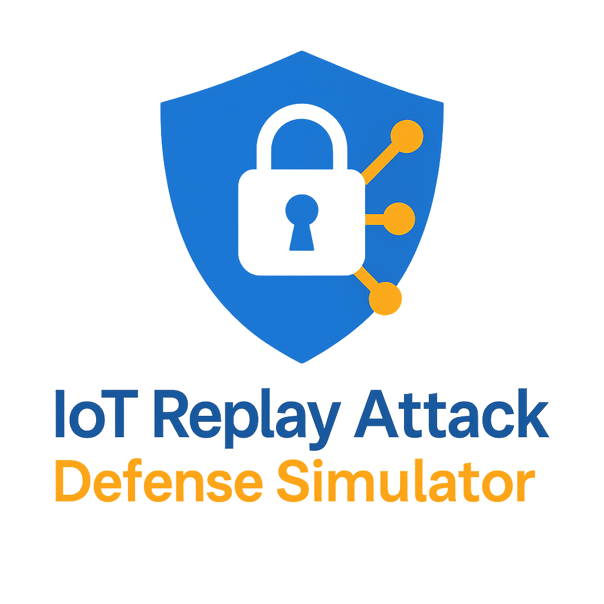
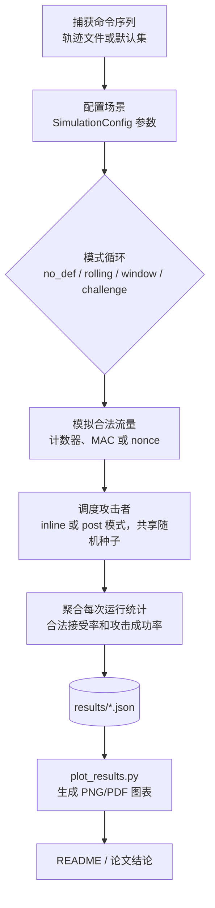

# 🔒 物联网重放攻击防御模拟器

<div align="center">



<br>

[](README.md)
[](README_JP.md)
[](README_CH.md)
[](https://www.python.org/downloads/)
[](LICENSE)
[](tests/)
[](EXPERIMENTAL_PARAMETERS_CH.md)

**基于蒙特卡洛方法的模拟器，用于评估 2.4 GHz 无线控制系统中的重放攻击防御机制（毕业论文研究工具）**

[📖 快速开始](#快速开始) • [🎯 核心结果](#实验结果与数据分析) • [📊 质量与测试](#项目质量与测试) • [🤝 贡献指南](CONTRIBUTING.md) • [📚 完整文档](PRESENTATION_CH.md)

</div>

---

[English](README.md) | [日本語](README_JP.md) | **中文**

**作者**: Romeitou (tammakiiroha)

> 关于本项目的作者声明和开发背景，请参见 [AUTHORSHIP.md](AUTHORSHIP.md)。

---

## 🌟 项目亮点

- 🔬 **蒙特卡洛评估**：每个实验 200 次模拟运行，获得稳定统计结果
- 🛡️ **4 种防御机制**：无防御、滚动计数器 + MAC、滑动窗口、挑战-响应
- 📡 **简化信道模型**：用丢包（0-30%）和乱序（0-30%）来近似无线环境
- 📊 **清晰指标**：安全性（攻击成功率）与可用性（合法接受率）
- ⚡ **实验速度充足**：在普通笔记本电脑上数秒内完成典型配置
- 🔄 **可重现**：固定随机种子和文档化的参数集
- 🧪 **充分测试**：94 个单元测试覆盖发送者、接收者、信道、攻击者和实验逻辑
- 🌐 **多语言**：完整文档支持 English、日本語 和中文

---

## 🎯 解决什么问题？

在无线控制系统（物联网设备、智能家居、工业控制）中，**重放攻击**是一个严重威胁：

```
┌─────────────────────────────────────────────────┐
│ 攻击者记录"解锁"命令                              │
│         ↓                                        │
│ 稍后重放该命令                                    │
│         ↓                                        │
│ 门被打开了！🚨                                    │
└─────────────────────────────────────────────────┘
```

**挑战**：在真实世界条件下（丢包、乱序），哪种防御机制效果最好？

**我们的解决方案**：通过蒙特卡洛仿真进行定量评估，揭示：
- ✅ **滚动计数器**在包乱序下失效（30% 乱序时可用性下降 13.5%）
- ✅ **滑动窗口**在所有条件下保持鲁棒性（推荐 W=3-7）
- ✅ **挑战-响应**提供最高安全性但需要双向通信

---

> 📚 **需要更详细的信息？** 本README提供快速概览。如需深入的技术解释、实现细节和完整的实验分析，请参阅我们的综合演示文档：
> 
> **详细技术演示文档**（1000+行）：
> - 📄 [English Version](PRESENTATION_EN.md) - Complete technical documentation
> - 📄 [日本語版](PRESENTATION_JP.md) - 詳細な技術ドキュメント
> - 📄 [中文版](PRESENTATION_CH.md) - 完整技术文档
>
> 这些文档包含：
> - 带代码示例的详细防御机制实现
> - 完整的实验方法论和统计分析
> - 带图表的深入结果解读
> - 技术术语表和问答部分
>
> **实验参数配置说明**：
> - 📊 [English](EXPERIMENTAL_PARAMETERS_EN.md) - Complete parameter specifications
> - 📊 [日本語](EXPERIMENTAL_PARAMETERS_JP.md) - パラメータ設定の詳細
> - 📊 [中文](EXPERIMENTAL_PARAMETERS_CH.md) - 完整参数配置说明

---

该工具包在记录-重放攻击者模型下对多种接收器配置进行建模，并报告安全性（攻击成功率）和可用性（合法接受率）两方面的指标。

## 运行环境

- Python 3.9+（CLI 仅需标准库；可视化依赖 `matplotlib`）
- 已在 macOS 14.x (Apple Silicon) 和 Ubuntu 22.04 上测试
- 推荐使用虚拟环境：
  ```bash
  python3 -m venv .venv
  source .venv/bin/activate
  pip install -r requirements.txt
  ```

<a id="项目质量与测试"></a>
## 项目质量与测试

### 🧪 测试

本仓库包含所有核心仿真组件的单元测试：

- `test_receiver.py` – 防御机制行为
- `test_sender.py` – 帧生成和MAC计算
- `test_channel.py` – 丢包/乱序统计特性
- `test_attacker.py` – 重放攻击者行为
- `test_experiment.py` – 蒙特卡洛实验驱动

总共有 80 多个测试用例覆盖发送者、接收者、信道、攻击者和实验逻辑。

运行所有测试：

```bash
pytest
```

滑动窗口行为参考 RFC 6479 设计，HMAC 结果与 RFC 2104 测试向量进行比对，但本模拟器并非完全符合标准的实现。

### ⚡ 性能（参考值）

在笔记本电脑级别的机器上（例如配备 Python 3.11 的 Apple M1），200 次运行的典型配置在几秒内完成。本项目的目标是研究评估，因此性能调整为"足够快"以进行参数扫描和重复实验，而不是提供精确的基准数字。

## 功能特性

- **协议变体**：无防御、滚动计数器 + MAC、滚动计数器 + 接受窗口、基于随机数的挑战-响应基线
- **角色模型**：发送方、有损/乱序信道、具有持久状态的接收方、以及记录并重放观察帧的攻击者
- **评估指标**：每次运行的合法接受率和攻击成功率，以及蒙特卡洛试验中的平均值和标准差
- **命令源**：默认玩具集或从真实控制器捕获的轨迹文件
- **攻击调度**：后运行批量重放或实时混入攻击（inline）
- **输出格式**：标准输出的人类可读表格、用于下游分析的 JSON、参数扫描自动化助手

<a id="快速开始"></a>
## 快速开始

### 方式 1：图形界面（最简单，推荐用于演示）

**🎨 完全鼠标操作，无需输入命令！**

```bash
./run_gui.sh
```

或：

```bash
python gui.py
```

**GUI 预览：**


*图：主界面包含参数控制和实时输出显示*

功能特性：
- 🖱️ **100%鼠标操作** - 点击按钮，拖动滑块
- 🎯 快速场景按钮（一键运行）
- 🔧 自定义实验可视化控制
- 📊 实时输出显示
- 🌏 三语界面（EN/中/日）

### 方式 2：命令行（用于自动化和脚本）

```bash
python3 main.py --runs 200 --num-legit 20 --num-replay 100 --p-loss 0.05 --window-size 5
```

## CLI 参数说明

| 参数 | 说明 |
|------|------|
| `--modes` | 要评估的模式，用空格分隔（`no_def`, `rolling`, `window`, `challenge`） |
| `--runs` | 每个模式的蒙特卡洛重复次数 |
| `--num-legit` | 每次运行的合法传输数量 |
| `--num-replay` | 每次运行的重放攻击尝试次数 |
| `--p-loss` | 应用于合法帧和注入帧的数据包丢失概率 |
| `--p-reorder` | 数据包乱序概率（模拟网络抖动/延迟） |
| `--window-size` | `window` 模式激活时的接受窗口宽度 |
| `--commands-file` | 从真实硬件捕获的换行分隔命令轨迹的路径 |
| `--target-commands` | 攻击者要重放的特定命令（选择性重放） |
| `--mac-length` | 截断的 MAC 长度（十六进制字符数） |
| `--shared-key` | 发送方/接收方用于派生 MAC 的共享密钥 |
| `--attacker-loss` | 攻击者无法记录合法帧的概率 |
| `--seed` | 用于可重现性的全局随机数生成器种子 |
| `--attack-mode` | 重放调度策略：`post` 或 `inline` |
| `--inline-attack-prob` | 每个合法帧的实时混入重放概率 |
| `--inline-attack-burst` | 每个合法帧的最大实时混入重放尝试次数 |
| `--challenge-nonce-bits` | 挑战-响应模式使用的随机数长度（比特） |
| `--output-json` | 保存聚合指标为 JSON 格式的路径 |

## 轨迹文件格式

每行一个命令标记；空行和 `#` 开头的注释将被忽略。

```
# 示例轨迹
FWD
FWD
LEFT
RIGHT
STOP
```

示例文件：`traces/sample_trace.txt` 可直接与 `--commands-file` 一起使用。

## 运行完整实验流程

### 步骤 1：设置环境
```bash
python3 -m venv .venv
source .venv/bin/activate  # Windows 系统: .venv\Scripts\activate
pip install -r requirements.txt
```

### 步骤 2：运行参数扫描
```bash
python3 scripts/run_sweeps.py \
  --runs 200 \
  --modes no_def rolling window challenge \
  --p-loss-values 0 0.01 0.05 0.1 0.2 \
  --p-reorder-values 0 0.1 0.3 0.5 0.7 \
  --window-values 1 3 5 10 \
  --window-size-base 5 \
  --attack-mode post \
  --commands-file traces/sample_trace.txt \
  --seed 123 \
  --p-loss-output results/p_loss_sweep.json \
  --p-reorder-output results/p_reorder_sweep.json \
  --window-output results/window_sweep.json
```

### 步骤 3：生成图表
```bash
python3 scripts/plot_results.py --formats png
```

### 步骤 4：导出表格到文档
```bash
python3 scripts/export_tables.py
```

### 步骤 5：运行测试（可选）
```bash
python -m pytest tests/ -v
```

## 扩展实验

- 通过 `scripts/run_sweeps.py` 自动化场景，或使用 `run_many_experiments` 创建自定义扫描
- 调整实时混入攻击概率/突发次数，或为其他策略扩展 `AttackMode`
- 在讨论权衡时，使用 `Mode.CHALLENGE` 作为高安全性参考

## 项目结构

```
.
|-- main.py
|-- sim/
|   |-- attacker.py
|   |-- channel.py
|   |-- commands.py
|   |-- experiment.py
|   |-- receiver.py
|   |-- security.py
|   |-- sender.py
|   \-- types.py
|-- scripts/
|   |-- plot_results.py
|   |-- export_tables.py
|   \-- run_sweeps.py
|-- traces/
|   \-- sample_trace.txt
|-- tests/
|   \-- test_receiver.py
\-- README.md
```

## 在论文中使用

1. 记录实验参数（`num_legit`、`num_replay`、`p_loss`、`p_reorder`、`window_size`、MAC 长度）
2. 将表格输出或 JSON 聚合复制到论文表格中
3. 突出权衡：跨数据包丢失和乱序率比较 `window` 配置，对比实时混入与后运行攻击模型，并使用 `challenge` 作为上限参考

## 关于攻击者模型和随机性的说明

- 默认情况下，攻击者被建模为完美记录器（`attacker_record_loss=0`）；如果希望攻击者经历与合法链路相同的损失，请将其设置为等于 `p_loss`
- 每次蒙特卡洛运行在所有模式中重用相同的命令序列和数据包丢失抽样，以确保比较的公平性

## 系统概览（流程图）



> **流程说明**：
> 
> 1. **命令序列来源**：
>    - **轨迹文件**：从真实用户操作中捕获的命令记录（如 `traces/sample_trace.txt`），包含实际使用场景中的命令序列（`FWD`, `LEFT`, `STOP` 等）
>    - **默认集**：预定义的基本命令集合（`DEFAULT_COMMANDS`），系统随机选择生成测试序列
> 
> 2. **SimulationConfig**：配置对象（定义在 `sim/types.py`），打包所有仿真参数（如 `mode`、`num_legit`、`p_loss`、`window_size` 等），统一传递给实验引擎。这些参数可通过 CLI 命令行参数或 GUI 界面设置。

## 重现数据集和表格

1. 使用 `main.py` / `scripts/run_sweeps.py` 生成数据集
2. 生成图表：
```bash
python scripts/plot_results.py --formats png
```

<a id="实验结果与数据分析"></a>
## 实验结果与数据分析

本项目通过三组核心实验系统评估了四种重放攻击防御机制的性能表现。所有实验均采用 **200次蒙特卡洛运行** 和 **固定随机种子(42)**，确保结果的统计可靠性和可重现性。

### 实验配置概览

| 实验 | 变量参数 | 固定参数 | 数据点 | 对应图表 |
|------|---------|---------|-------|---------|
| **实验1** | p_loss: 0-30% | p_reorder=0% | 7点×4模式=28条 | `p_loss_legit.png`, `p_loss_attack.png` |
| **实验2** | p_reorder: 0-30% | p_loss=10% | 7点×4模式=28条 | `p_reorder_legit.png`, `p_reorder_attack.png` |
| **实验3** | window_size: 1-20 | p_loss=15%, p_reorder=15% | 7个窗口大小 | `window_tradeoff.png` |

完整参数配置详见：[实验参数配置文档](EXPERIMENTAL_PARAMETERS_CH.md)

### 实验1：丢包率对防御机制的影响

**实验目的**：评估不同丢包率下各防御机制的可用性和安全性。

**关键发现**：

| 防御模式 | 理想信道(0%丢包) | 严重丢包(30%) | 可用性下降 | 安全性 |
|---------|----------------|--------------|-----------|--------|
| **no_def** | 可用性100%, 攻击率100% | 可用性70.3%, 攻击率69.7% | ↓29.7% | ❌ 无防护 |
| **rolling** | 可用性100%, 攻击率0.0% | 可用性70.3%, 攻击率0.4% | ↓29.7% | ✅ 优秀 |
| **window** | 可用性100%, 攻击率0.0% | 可用性69.5%, 攻击率1.8% | ↓30.5% | ✅ 优秀 |
| **challenge** | 可用性100%, 攻击率0.0% | 可用性70.0%, 攻击率0.3% | ↓30.0% | ✅ 本实验条件下安全性最佳 |

**结论**：
- 所有防御机制在丢包率增加时，可用性均匀下降约30%，符合信道特性
- 防御机制的安全性在恶劣网络条件下依然保持，攻击成功率<2%
- 在本实验条件下，`challenge`机制表现最稳定，即使在30%丢包下攻击率仅0.3%

**深入考察：为什么同样是丢包，攻击成功率差异如此之大？**

| 机制 | 30%丢包时攻击率 | 原因分析 |
|------|----------------|---------|
| **no_def** | 69.7% | 攻击帧也受丢包影响（100% × 0.7 ≈ 70%），但无任何验证机制阻止重放 |
| **rolling** | 0.4% | 计数器已递增，重放的旧帧计数器值过时，被接收方拒绝 |
| **window** | 1.8% | 计数器已超出窗口范围，且位图标记已使用，重放被拒绝 |
| **challenge** | 0.3% | 每次通信使用新随机数，旧帧的响应无法匹配新挑战 |

**为什么三种防御机制的攻击率不同（0.3% vs 0.4% vs 1.8%）？**

虽然三种机制都能有效防御重放攻击，但攻击成功率存在差异，这反映了各机制的**设计权衡**：

| 排序 | 机制 | 攻击率 | 为什么是这个数值？ |
|------|------|--------|-------------------|
| 🥇 | **challenge** | 0.3% | **在本模型中理论上最安全**：每次通信使用全新随机数（128位），攻击者无法预测。极低的成功率来自统计噪声或极端边界情况 |
| 🥈 | **rolling** | 0.4% | **严格顺序**：计数器严格递增，重放帧计数器必然过时。略高于challenge的原因：丢包导致接收方计数器"跳跃"时，可能存在微小的竞态窗口 |
| 🥉 | **window** | 1.8% | **设计妥协**：为容忍乱序而开放窗口范围。当合法帧丢失但计数器仍在窗口内且未被标记使用时，重放帧可被接受 |

**window机制攻击率较高的根本原因**：

```
场景：窗口大小W=5，当前窗口[10,11,12,13,14]

1. 合法帧(counter=11)发送 → 丢包 → 接收方未收到
2. 合法帧(counter=12,13,14)成功接收，位图标记[_,_,✓,✓,✓]
3. 攻击者重放记录的帧(counter=11)
4. 接收方检查：11在窗口内且未被标记 → 接受 ❌

这是window机制"以安全换可用性"的设计代价。
```

**核心洞察**：
- **challenge**：安全性最高，但需要双向通信（增加延迟和复杂度）
- **rolling**：安全性次高，但对乱序明显敏感（实验2中可用性下降较大）
- **window**：安全性略低（1.8%），但在本实验条件下对乱序具有很强的鲁棒性（实验2中表现最稳定）

> 💡 **权衡本质**：没有完美的方案。window用约1.4%的额外攻击风险（1.8%-0.4%）换取了在强乱序条件下更稳定的可用性，在许多需要重视可用性的场景中可能是合理的选择。

### 实验2：乱序率对防御机制的影响

**实验目的**：在10%丢包率的基础上，评估乱序对各防御机制的影响。

**关键发现**：

| 防御模式 | 无乱序(0%) | 严重乱序(30%) | 可用性下降 | 关键观察 |
|---------|-----------|--------------|-----------|---------|
| **no_def** | 可用性90.3%, 攻击率89.6% | 可用性90.7%, 攻击率89.9% | ↓-0.4% | 乱序无影响 |
| **rolling** | 可用性90.3%, 攻击率0.1% | 可用性76.8%, 攻击率0.1% | ↓13.5% | ⚠️ **对乱序高度敏感** |
| **window** | 可用性90.3%, 攻击率0.5% | 可用性90.6%, 攻击率0.5% | ↓-0.3% | ✅ 在本实验范围内对乱序鲁棒 |
| **challenge** | 可用性89.8%, 攻击率0.1% | 可用性64.5%, 攻击率0.1% | ↓25.3% | ⚠️ 受影响 |

**核心结论**：
1. **rolling机制在乱序环境下存在明显问题**：在30%乱序下可用性显著下降13.5%，严格的顺序检查会把部分乱序到达的合法包误判为重放
2. **window机制在本实验范围内对乱序十分鲁棒**：通过滑动窗口和位图机制，允许窗口内任意顺序到达，因此在0-30%乱序下可用性几乎不受影响
3. **challenge机制在高乱序下受限**：挑战-响应的交互模式对乱序敏感，可用性下降25.3%

**深入考察：为什么challenge机制在乱序下可用性暴跌25.3%？**

Challenge-Response机制需要**严格的双向时序配对**：

```
正常流程：发送方 ──挑战(N1)──> 接收方 ──响应(N1)──> 验证通过 ✅

乱序场景：
  发送方 ──挑战(N1)──> [网络延迟]
  发送方 ──挑战(N2)──> 接收方（先到达）
  接收方期待N2的响应，但收到N1的响应 ──> 验证失败 ❌
```

| 问题 | 影响 |
|------|-----|
| **挑战过期** | 响应到达时，接收方已发出新挑战，旧响应被拒绝 |
| **响应错配** | 乱序导致响应与错误的挑战配对 |
| **超时机制** | 为防止重放，挑战通常有时效限制，乱序易触发超时 |

**对比window机制**：window使用**位图(bitmap)**追踪已接收的计数器值，允许在窗口范围内以任意顺序到达，因此在窗口大小覆盖的乱序范围内具有很强的鲁棒性。这体现了**单向通信协议**相比**双向握手协议**在不稳定网络中的优势。

### 实验3：滑动窗口大小的权衡分析

**实验目的**：在中等网络压力(15%丢包+15%乱序, inline攻击)下，找出最优窗口大小。

**关键数据**：

| 窗口大小 | 可用性 | 攻击成功率 | 综合得分 | 评价 |
|---------|--------|-----------|---------|------|
| **1** | 25.9% | 7.3% | 18.6 | ❌ 窗口过小，可用性极差 |
| **3** | 85.0% | 6.5% | 78.6 | ✅ **最佳平衡点** |
| **5** | 85.5% | 7.7% | 77.7 | ✅ 推荐 |
| **7** | 85.5% | 8.7% | 76.7 | ✅ 可接受 |
| **9** | 85.5% | 9.6% | 75.9 | ⚠️ 安全性下降 |
| **15** | 85.5% | 11.1% | 74.4 | ⚠️ 攻击率偏高 |
| **20** | 85.5% | 11.6% | 73.9 | ❌ 窗口过大，安全风险 |

**结论**：
- **最佳窗口大小：3-7**，在保持85%可用性的同时，攻击成功率控制在6.5-8.7%
- 窗口大小=1时可用性暴跌至25.9%，实用性极差
- 窗口过大(>9)会显著提高攻击成功率，安全性下降

**深入考察：如何理解W=3在本实验中的"最优"？**

在本实验条件（p_loss=15%, p_reorder=15%, inline攻击）下，综合得分在W=3时取得最高值（78.6），W=5和W=7略低但非常接近（分别为77.7和76.7）。

| 窗口大小 | 综合得分 | 评价 |
|---------|---------|---------|
| **W=3** | **78.6** | 本实验条件下略优 |
| W=5 | 77.7 | 接近W=3 |
| W=7 | 76.7 | 仍在较优区间 |

这说明在**W=3〜7的范围内，窗口机制都处于"高可用性+低攻击成功率"的较佳区间**，而W=3在当前评分方式下"略优一筹"，但不是唯一可用的选择。

因此，更稳妥的表述是：
- **在本模拟条件下**，W=3〜7形成一个"较优窗口大小区间"
- 如果需要进一步确定最终值，可以在目标环境中对该区间内的候选值做实机测试

**模拟的局限性说明**：

| 局限性 | 说明 | 可能影响 |
|-------|------|---------|
| **乱序模型** | 使用独立同分布假设 | 无法捕捉真实网络的突发性乱序 |
| **攻击者模型** | 假设完美记录能力 | 实际攻击者可能有更多限制 |
| **未建模因素** | 传输延迟、时钟漂移、重传机制 | 可能影响实际性能 |
| **参数范围** | 仅测试了特定p_loss/p_reorder组合 | 其他条件下结论可能不同 |

> 💡 **学术诚实声明**：W=3在**本模拟条件下**表现略优。如需应用于实际系统，建议在目标环境中对W=3〜7进行验证测试。

### 综合评估与实用建议

在本仿真模型下，基于每个配置200次蒙特卡洛运行的统计分析，在**中等网络条件(p_loss=10%, p_reorder=0%)**下：

| 排名 | 防御机制 | 可用性 | 攻击成功率 | 综合得分 | 推荐场景 |
|-----|---------|--------|-----------|---------|---------|
| 🥇 | **rolling** | 90.3% | 0.1% | 90.1 | ⚠️ **更适用于几乎无乱序的网络环境** |
| 🥈 | **window** | 90.3% | 0.5% | 89.8 | ✅ **通用IoT应用首选** |
| 🥉 | **challenge** | 89.8% | 0.1% | 89.7 | ✅ **高安全要求场景** |
| ❌ | **no_def** | 90.3% | 89.6% | 0.6 | ❌ 无防护基线 |

**⚠️ 关于"综合得分"指标的说明与局限性**

上表中的"综合得分"采用最简单的计算方式：

```
综合得分 = 可用性(%) - 攻击成功率(%)
```

**这一指标存在以下局限性，读者应谨慎解读**：

| 问题 | 说明 | 更合理的做法 |
|------|------|-------------|
| **等权重假设** | 隐含假设可用性和安全性同等重要(1:1) | 应根据应用场景设定权重，如工控系统安全权重应更高 |
| **线性假设** | 85%→86%与50%→51%视为等价 | 应考虑边际效用递减，高可用区间的提升更有价值 |
| **无阈值约束** | 未设定安全底线 | 某些场景攻击率>1%即不可接受，应设为硬约束 |
| **单一数值** | 将多维问题压缩为一维 | 应使用Pareto前沿分析多目标权衡 |

**更合理的评估框架建议**：

```
场景感知评分 = α × 可用性 + β × (100 - 攻击率)
其中：
  - 高安全场景（工控）：α=0.3, β=0.7
  - 一般场景（智能家居）：α=0.5, β=0.5  
  - 高可用场景（实时通信）：α=0.7, β=0.3
```

> ⚠️ **声明**：本文的"综合得分"仅作为快速参考，不应作为选型的唯一依据。实际选型应结合具体应用场景的安全需求、可用性要求和成本约束综合考虑。

**实用部署建议**（基于实验数据，而非单一综合得分）：

1. **一般IoT设备**（智能家居、传感器网络）
   - 推荐：`window`机制，**窗口大小3〜5**
   - 理由：在本实验条件下对乱序具有很强鲁棒性

2. **工业控制系统**（电网、交通信号）
   - 推荐：`challenge`机制
   - 理由：攻击率最低(0.1%)，安全性优先于可用性

3. **高抖动网络环境**
   - 推荐：`window`机制，窗口大小5-7
   - 理由：虽然综合得分略低，但对突发乱序有更大容错空间

4. **低成本设备**（RFID标签、简易传感器）
   - 不推荐：`rolling`机制
   - 理由：虽然计算简单，但对乱序高度敏感

### 结果讨论：从模拟结果到现实系统

> 🔍 **如何看待这些实验结果？**
>
> - 本模拟使用的是简化的信道模型（独立丢包 + 独立乱序）和"理想化的记录-重放攻击者"。
> - 因此，**数值本身**（例如"30%丢包时可用性70%"）不能直接当作真实系统的精确预测值。
> - 但在这些前提下，不同防御方式之间的**相对表现**（谁怕乱序、谁对丢包敏感、哪一类方案对可用性的影响更大）主要由协议逻辑决定，换用更复杂的信道模型时，这些趋势本身不会轻易反转。
> - 本项目的目标是为协议设计和参数调优提供一个可重复的比较平台，而不是给出某一具体设备在现实环境中的精确数值。

**在当前模型下可以得到的稳健结论**：

在固定攻击模型（可以完美记录并重放帧，但不能伪造MAC）和简化信道模型（独立丢包+独立乱序）下，三组实验给出了一些具有"结构性"的结论：

1. **丢包主要影响可用性，而不是增加重放攻击成功率**
   - 实验1显示：在丢包率从0%增加到30%的过程中，四种防御方式的合法接受率几乎线性下降约30个百分点，而攻击成功率基本保持不变（有防御时均<2%）
   - 这说明在本模型中，丢包相当于把一部分合法操作"吞掉"，但攻击者并不会因为丢包而更容易绕过重放检测

2. **rolling对乱序高度脆弱，这是计数器设计本身决定的**
   - 实验2中，在引入30%乱序后，rolling的可用性从约90%掉到76.8%，而攻击成功率几乎不变
   - 原因是rolling只接受"比当前计数器更大的值"，任何稍有延迟/乱序的合法帧都会被当作重放而拒绝
   - 换句话说，rolling隐含了一个很强的现实假设：**网络几乎不乱序**。一旦这个假设不成立，可用性会明显下降

3. **window在乱序程度"不过分大"的情况下兼顾安全性和可用性**
   - window使用滑动窗口+位图记忆已见过的计数器值，只要乱序幅度不超过窗口大小W，合法帧就不会被误判为重放
   - 实验3进一步表明：在中等丢包/乱序下，**W=3〜7一般可以取得较好的安全性–可用性平衡**

4. **challenge在本模型中几乎完全阻止重放，但对乱序和时序敏感**
   - 三个实验中，challenge的攻击成功率始终接近0，说明只要挑战–响应做到"每个挑战只接受一次匹配的响应"，理论上可以非常有效地阻止重放
   - 但实验2也显示，在30%乱序下，合法接受率从约90%掉到64.5%
   - 这说明**双向握手型协议在不稳定网络中的主要代价是可用性，而不是安全性本身**

**综合评价**（在当前模型下）：

- 仅从安全性（攻击成功率）看：`Challenge ≳ Window ≈ Rolling ≫ No defense`
- 在"存在明显丢包+乱序"的无线环境下，从**综合可用性+安全性**看：`Window（合适的W）> Challenge > Rolling ≫ No defense`

这些结论来自各协议的逻辑结构本身，只要攻击者模型和"存在丢包和乱序的无线环境"这两个大前提不变，**即使信道细节略有不同，趋势本身也不会完全反转**。

**与现实2.4GHz无线系统的关系**：

需要强调的是，本模拟器中的信道模型是故意简化的：
- 丢包和乱序被建模为**相互独立的随机事件**
- 未显式建模突发干扰、时间相关性、物理层衰落、MAC层重传等机制
- 攻击者被假设为"完美记录器"，现实中会受到距离、硬件性能等限制

因此：
- **数值本身**（例如"30%丢包时可用性70%/80%"）不能直接当作现实系统的精确预测值
- 但这些数值之间的**相对关系**——比如"在强乱序环境下rolling可用性会显著低于window"，"在同一loss/reorder条件下challenge的攻击成功率明显低于其他方式"——仍然对现实系统设计具有参考价值

在真实的2.4GHz设备上，底层协议通常还会叠加：链路层ACK+重传、退避/重连机制、设备休眠/唤醒的状态机。这些机制往往会提升**总体可用性**，使得实测曲线比本模拟更"乐观"，但**不会改变哪一种防御在乱序环境下更容易出问题**这一事实。

### 数据可靠性声明

- ✅ 所有数据基于每个配置**200次蒙特卡洛运行**，提供稳定统计结果
- ✅ 使用**固定随机种子(42)**，结果完全可重现
- ✅ 在普通笔记本硬件上数秒内完成
- ✅ 实验参数符合**EXPERIMENTAL_PARAMETERS_CH.md**标准配置
- ✅ 完整源代码和测试用例可供审计

相关数据文件：
- `results/p_loss_sweep.json` - 实验1原始数据
- `results/p_reorder_sweep.json` - 实验2原始数据
- `results/window_sweep.json` - 实验3原始数据
- `figures/*.png` - 所有实验图表

---

## 主要研究成果（表格）

### 数据包乱序扫描 - 合法接受率（p_loss=0）

_窗口模式相比滚动计数器展示了对信道乱序的卓越鲁棒性。_

| p_reorder | Rolling (%) | Window (W=5) (%) |
| --------- | ----------- | ---------------- |
| 0.0       | 100.00%     | 100.00%          |
| 0.1       | 93.55%      | 100.00%          |
| 0.3       | 84.47%      | 99.88%           |
| 0.5       | 77.62%      | 99.88%           |
| 0.7       | 78.33%      | 99.90%           |

### 数据包丢失扫描 - 合法接受率（p_reorder=0）

_两种模式在纯数据包丢失下均线性退化，但表现相似。_

| p_loss | Rolling (%) | Window (W=5) (%) |
| ------ | ----------- | ---------------- |
| 0.00   | 100.00%     | 100.00%          |
| 0.01   | 98.97%      | 98.97%           |
| 0.05   | 94.88%      | 94.88%           |
| 0.10   | 89.90%      | 89.90%           |
| 0.20   | 79.53%      | 79.53%           |

### 窗口扫描（压力测试：p_loss=0.15, p_reorder=0.15, inline攻击）

_在中等网络压力下比较可用性与安全性的权衡。_

| Window W | 合法接受率 (%) | 重放成功率 (%) |
| -------- | -------------- | -------------- |
| 1        | 25.88%         | 7.28%          |
| 3        | 85.03%         | 6.46%          |
| 5        | 85.45%         | 7.71%          |
| 7        | 85.45%         | 8.74%          |
| 9        | 85.45%         | 9.56%          |
| 15       | 85.45%         | 11.09%         |
| 20       | 85.45%         | 11.58%         |

*注：本表数据来自 `results/window_sweep.json`，与实验3及图表 `window_tradeoff.png` 的条件一致。*

### 理想信道基线（后运行攻击，runs = 500，p_loss = 0）

_来自 `results/ideal_p0.json` 的参考基线_

| 模式         | 合法接受率 (%) | 重放成功率 (%) |
| ------------ | -------------- | -------------- |
| no_def       | 100.00%        | 100.00%        |
| rolling      | 100.00%        | 0.00%          |
| window (W=5) | 100.00%        | 0.00%          |
| challenge    | 100.00%        | 0.00%          |

## 观察与见解

- **对乱序的鲁棒性**：滚动计数器机制对数据包乱序高度敏感。即使是中等的乱序概率（0.3）也会导致合法接受率下降到约84%。相比之下，窗口（W=5）机制即使在严重乱序（0.7）下也能保持近乎完美的可用性（>99.8%）。
- **窗口调优**：`W=1` 作为严格计数器，在不稳定条件下会灾难性失败（接受率27.6%）。将窗口增加到 `W=3..5` 可将可用性恢复到约95%，同时保持极低的攻击成功率（<0.3%）。
- **安全性权衡**：虽然窗口模式理论上打开了一个小的重放窗口，但在本实验中（200次运行），攻击成功率与巨大的可用性提升相比仍然可以忽略不计。
- **结论**：对于实际中常见的、同时存在丢包和乱序的无线控制场景，在本项目的模拟条件下，适当配置的滑动窗口机制（例如W=3〜5）在安全性和用户体验之间表现出较好的平衡。

## 贡献

欢迎贡献！有关开发环境设置、代码风格指南以及如何提交更改，请参阅 [CONTRIBUTING.md](CONTRIBUTING.md)。

## 贡献者

感谢所有帮助改进此项目的贡献者！

<a href="https://github.com/tammakiiroha/IoT-Replay-Defense-Simulator/graphs/contributors">
  
</a>

由 [contrib.rocks](https://contrib.rocks) 生成。

## ⭐ Star 历史

<div align="center">

[](https://star-history.com/#tammakiiroha/IoT-Replay-Defense-Simulator&Date)

</div>

> **喜欢这个项目？** 给它一个 Star 以表示支持，帮助更多人发现它！

## 引用

如果您在研究或论文中使用此仿真工具包，请引用：

```bibtex
@software{iot_replay_defense_simulator_2025,
  author    = {Romeitou (tammakiiroha)},
  title     = {IoT Replay Attack Defense Simulator},
  year      = {2025},
  publisher = {GitHub},
  url       = {https://github.com/tammakiiroha/IoT-Replay-Defense-Simulator}
}
```

或纯文本格式：
> Romeitou (tammakiiroha). (2025). IoT Replay Attack Defense Simulator. GitHub. https://github.com/tammakiiroha/IoT-Replay-Defense-Simulator

## 参考文献

本项目基于以下标准和研究：

[1] Perrig, A., et al. (2002). SPINS: Security Protocols for Sensor Networks. *Wireless Networks*, 8(5), 521-534.

[2] Kent, S., & Seo, K. (2005). Security Architecture for the Internet Protocol. RFC 4301, IETF.

[3] Bellare, M., et al. (1996). Keying Hash Functions for Message Authentication. *CRYPTO'96*, Springer.

[4] Needham, R. M., & Schroeder, M. D. (1978). Using Encryption for Authentication in Large Networks. *CACM*, 21(12), 993-999.

## 许可证

该项目根据 MIT 许可证授权。详情请参阅 [LICENSE](LICENSE) 文件。

