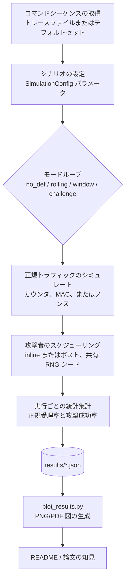

# 🔒 IoT リプレイ攻撃防御シミュレータ

<div align="center">


<br>

[](README.md)
[](README_JP.md)
[](README_CH.md)
[](https://www.python.org/downloads/)
[](LICENSE)
[](tests/)
[](EXPERIMENTAL_PARAMETERS_JP.md)

**2.4 GHz 無線制御システムにおけるリプレイ攻撃防御メカニズムを評価するモンテカルロベースのシミュレータ（卒業論文研究ツール）**

[📖 クイックスタート](#クイックスタート) • [🎯 主要結果](#実験結果とデータ分析) • [📊 品質とテスト](#プロジェクト品質とテスト) • [🤝 コントリビューション](CONTRIBUTING.md) • [📚 完全ドキュメント](PRESENTATION_JP.md)

</div>

---

[English](README.md) | **日本語** | [中文](README_CH.md)

**著者**: Romeitou (tammakiiroha)

> 本プロジェクトの著作権・開発経緯の詳細については、[AUTHORSHIP.md](AUTHORSHIP.md) を参照してください。

---

## 🌟 ハイライト

- 🔬 **モンテカルロ評価**：実験ごとに 200 回のシミュレーション実行で安定した統計を取得
- 🛡️ **4 つの防御メカニズム**：無防御、ローリングカウンタ + MAC、スライディングウィンドウ、チャレンジ-レスポンス
- 📡 **簡略化チャネルモデル**：パケット損失（0-30%）と順序入れ替え（0-30%）で無線環境を近似
- 📊 **明確なメトリクス**：セキュリティ（攻撃成功率）対ユーザビリティ（正規受理率）
- ⚡ **実験に十分な速度**：一般的なラップトップで数秒で完了
- 🔄 **再現可能**：固定ランダムシードと文書化されたパラメータセット
- 🧪 **十分なテスト**：送信者、受信者、チャネル、攻撃者、実験ロジックをカバーする 94 単体テスト
- 🌐 **多言語対応**：English、日本語、中文の完全ドキュメント

---

## 🎯 解決する問題

無線制御システム（IoT デバイス、スマートホーム、産業制御）において、**リプレイ攻撃**は深刻な脅威です：

```
┌─────────────────────────────────────────────────┐
│ 攻撃者が「UNLOCK」コマンドを記録                  │
│         ↓                                        │
│ 後でそれを再生                                    │
│         ↓                                        │
│ ドアが開く！🚨                                    │
└─────────────────────────────────────────────────┘
```

**課題**：実世界の条件（パケット損失、順序入れ替え）下で、どの防御メカニズムが最も効果的か？

**私たちの解決策**：モンテカルロシミュレーションによる定量的評価により明らかに：
- ✅ **ローリングカウンタ**はパケット順序入れ替えで失敗（30% 順序入れ替えで可用性 13.5% 低下）
- ✅ **スライディングウィンドウ**はすべての条件で堅牢性を維持（W=3-7 推奨）
- ✅ **チャレンジ-レスポンス**は最高のセキュリティを提供するが双方向通信が必要

---

> 📚 **より詳しい情報が必要ですか？** このREADMEは概要を提供します。技術的な詳細説明、実装の詳細、完全な実験分析については、包括的なプレゼンテーション資料をご参照ください：
> 
> **詳細な技術プレゼンテーション**（1000行以上）：
> - 📄 [English Version](PRESENTATION_EN.md) - Complete technical documentation
> - 📄 [日本語版](PRESENTATION_JP.md) - 詳細な技術ドキュメント
> - 📄 [中文版](PRESENTATION_CH.md) - 完整技术文档
>
> これらの資料には以下が含まれます：
> - コード例を含む防御メカニズムの詳細実装
> - 完全な実験方法論と統計分析
> - 図表を用いた詳細な結果解釈
> - 技術用語集とQ&Aセクション
>
> **実験パラメータ設定書**：
> - 📊 [English](EXPERIMENTAL_PARAMETERS_EN.md) - Complete parameter specifications
> - 📊 [日本語](EXPERIMENTAL_PARAMETERS_JP.md) - パラメータ設定の詳細
> - 📊 [中文](EXPERIMENTAL_PARAMETERS_CH.md) - 完整参数配置说明

---

このツールキットは、記録再生攻撃者の下で複数の受信機構成をモデル化し、セキュリティ（攻撃成功率）とユーザビリティ（正規受理率）の両方の指標を報告します。

## 動作環境

- Python 3.9+ (CLI は標準ライブラリのみ、可視化には `matplotlib` を使用)
- macOS 14.x (Apple Silicon) および Ubuntu 22.04 でテスト済み
- 仮想環境の使用（推奨）:
  ```bash
  python3 -m venv .venv
  source .venv/bin/activate
  pip install -r requirements.txt
  ```

## プロジェクト品質とテスト

### 🧪 テスト

このリポジトリには、すべてのコアシミュレーションコンポーネントの単体テストが含まれています：

- `test_receiver.py` – 防御メカニズムの動作
- `test_sender.py` – フレーム生成とMAC計算
- `test_channel.py` – パケット損失/順序入れ替えの統計
- `test_attacker.py` – リプレイ攻撃者の動作
- `test_experiment.py` – モンテカルロ実験ドライバー

合計で 80 以上のテストケースが、送信者、受信者、チャネル、攻撃者、および実験ロジックをカバーしています。

すべてのテストを実行：

```bash
pytest
```

スライディングウィンドウの動作は RFC 6479 を参考に設計され、HMAC の結果は RFC 2104 のテストベクトルと照合されていますが、このシミュレータは完全な標準準拠実装を意図したものではありません。

### ⚡ パフォーマンス（参考値）

ラップトップクラスのマシン（例：Python 3.11 を搭載した Apple M1）では、200 回実行の典型的な構成が数秒で完了します。このプロジェクトの目標は研究評価であるため、パフォーマンスは正確なベンチマーク数値を提供するのではなく、パラメータスイープと繰り返し実験に「十分な速度」にチューニングされています。

## 特徴

- **プロトコルバリエーション**: 無防御、ローリングカウンタ + MAC、ローリングカウンタ + 受理ウィンドウ、ノンスベースのチャレンジレスポンス
- **ロールモデル**: 送信者、損失/順序入れ替えチャネル、永続状態を持つ受信者、および観測フレームを記録・再生する攻撃者
- **評価指標**: 各試行の正規受理率と攻撃成功率、モンテカルロ試行における平均値と標準偏差
- **コマンドソース**: デフォルトのトイセットまたは実機コントローラから取得したトレースファイル
- **攻撃スケジューリング**: ポストラン一括再生またはリアルタイム混入（inline）挿入
- **出力形式**: 標準出力への人間可読テーブル、下流解析用 JSON、パラメータスイープ自動化ヘルパー

## クイックスタート

### 方法1：グラフィカルインターフェース（最も簡単、デモに推奨）

**🎨 完全マウス操作、タイピング不要！**

```bash
./run_gui.sh
```

または：

```bash
python gui.py
```

**GUI プレビュー：**


*図：パラメータ制御とリアルタイム出力を備えたメインインターフェース*

機能：
- 🖱️ **100%マウス操作** - ボタンクリック、スライダードラッグ
- 🎯 クイックシナリオボタン（ワンクリック実行）
- 🔧 ビジュアルコントロールでカスタム実験
- 📊 リアルタイム出力表示
- 🌏 多言語対応インターフェース（EN/中/日）

### 方法2：コマンドライン（自動化とスクリプト用）

```bash
python3 main.py --runs 200 --num-legit 20 --num-replay 100 --p-loss 0.05 --window-size 5
```

## CLI リファレンス

| フラグ | 説明 |
|------|------|
| `--modes` | 評価するモード（`no_def`, `rolling`, `window`, `challenge`）をスペース区切りで指定 |
| `--runs` | モードごとのモンテカルロ試行回数 |
| `--num-legit` | 試行ごとの正規送信数 |
| `--num-replay` | 試行ごとの再生攻撃試行数 |
| `--p-loss` | 正規フレームと注入フレームの両方に適用されるパケット損失確率 |
| `--p-reorder` | パケット順序入れ替え確率（ネットワークジッタ/遅延をシミュレート） |
| `--window-size` | `window` モード有効時の受理ウィンドウ幅 |
| `--commands-file` | 実ハードウェアから取得した改行区切りコマンドトレースへのパス |
| `--target-commands` | 攻撃者が再生する特定のコマンド（選択的再生） |
| `--mac-length` | 切り詰められた MAC 長（16進文字数） |
| `--shared-key` | 送信者/受信者が MAC 導出に使用する共有秘密鍵 |
| `--attacker-loss` | 攻撃者が正規フレームの記録に失敗する確率 |
| `--seed` | 再現性のためのグローバル RNG シード |
| `--attack-mode` | 再生スケジューリング戦略: `post` または `inline`（リアルタイム混入） |
| `--inline-attack-prob` | 正規フレームごとのリアルタイム混入（inline）再生確率 |
| `--inline-attack-burst` | 正規フレームごとの最大リアルタイム混入（inline）再生試行回数 |
| `--challenge-nonce-bits` | チャレンジレスポンスモードで使用されるノンス長（ビット） |
| `--output-json` | 集計メトリクスを JSON 形式で保存するパス |

## トレースファイル形式

1行に1つのコマンドトークンを記述します。空行と `#` で始まるコメントは無視されます。

```
# サンプルトレース
FWD
FWD
LEFT
RIGHT
STOP
```

サンプルファイル: `traces/sample_trace.txt` を `--commands-file` で直接使用できます。

## 完全な実験パイプラインの実行

### ステップ 1: 環境のセットアップ
```bash
python3 -m venv .venv
source .venv/bin/activate  # Windows の場合: .venv\Scripts\activate
pip install -r requirements.txt
```

### ステップ 2: パラメータスイープの実行
```bash
python3 scripts/run_sweeps.py \
  --runs 200 \
  --modes no_def rolling window challenge \
  --p-loss-values 0 0.01 0.05 0.1 0.2 \
  --p-reorder-values 0 0.1 0.3 0.5 0.7 \
  --window-values 1 3 5 10 \
  --window-size-base 5 \
  --attack-mode post \
  --commands-file traces/sample_trace.txt \
  --seed 123 \
  --p-loss-output results/p_loss_sweep.json \
  --p-reorder-output results/p_reorder_sweep.json \
  --window-output results/window_sweep.json
```

### ステップ 3: 図の生成
```bash
python3 scripts/plot_results.py --formats png
```

### ステップ 4: ドキュメントへのテーブルエクスポート
```bash
python3 scripts/export_tables.py
```

### ステップ 5: テストの実行（オプション）
```bash
python -m pytest tests/ -v
```

## 実験の拡張

- `scripts/run_sweeps.py` でシナリオを自動化、または `run_many_experiments` でカスタムスイープを作成
- リアルタイム混入（inline）攻撃の確率/バーストを調整、または他の戦略のために `AttackMode` を拡張
- トレードオフを議論する際の高セキュリティ参照として `Mode.CHALLENGE` を使用

## プロジェクト構成

```
.
|-- main.py
|-- sim/
|   |-- attacker.py
|   |-- channel.py
|   |-- commands.py
|   |-- experiment.py
|   |-- receiver.py
|   |-- security.py
|   |-- sender.py
|   \-- types.py
|-- scripts/
|   |-- plot_results.py
|   |-- export_tables.py
|   \-- run_sweeps.py
|-- traces/
|   \-- sample_trace.txt
|-- tests/
|   \-- test_receiver.py
\-- README.md
```

## 論文での使用方法

1. 実験パラメータを文書化（`num_legit`, `num_replay`, `p_loss`, `p_reorder`, `window_size`, MAC 長）
2. テーブル出力または JSON 集計を論文のテーブルにコピー
3. トレードオフを強調: パケット損失と順序入れ替え率にわたる `window` 構成を比較、リアルタイム混入（inline）対ポストラン攻撃モデルを対比、上限参照として `challenge` を使用

## 攻撃者モデルとランダム性に関する注意事項

- デフォルトでは、攻撃者は完全な記録者としてモデル化されます（`attacker_record_loss=0`）。正規リンクと同じ損失を攻撃者に経験させたい場合は、`p_loss` と等しく設定してください
- すべてのモンテカルロ試行は、すべてのモードで同じコマンドシーケンスとパケット損失ドローを再利用するため、比較が公平になります

## システム概要（フローチャート）



> **フロー説明**：
> 
> 1. **コマンドシーケンスのソース**：
>    - **トレースファイル**：実際のユーザー操作から取得されたコマンド記録（例：`traces/sample_trace.txt`）、実使用シナリオのコマンドシーケンス（`FWD`、`LEFT`、`STOP` など）を含む
>    - **デフォルトセット**：事前定義された基本コマンドセット（`DEFAULT_COMMANDS`）、システムがランダムにテストシーケンスを生成
> 
> 2. **SimulationConfig**：設定オブジェクト（`sim/types.py` で定義）、すべてのシミュレーションパラメータ（`mode`、`num_legit`、`p_loss`、`window_size` など）をバンドルし、実験エンジンに統一的に渡します。これらのパラメータは CLI コマンドライン引数または GUI インターフェースで設定できます。

## データセットとテーブルの再現

1. `main.py` / `scripts/run_sweeps.py` でデータセットを生成
2. 図を生成:
```bash
python scripts/plot_results.py --formats png
```

## 実験結果とデータ分析

本プロジェクトでは、3つのコア実験を通じて4種類のリプレイ攻撃防御メカニズムの性能を体系的に評価しました。すべての実験は**200回のモンテカルロ実行**と**固定ランダムシード(42)**を使用し、統計的信頼性と再現性を確保しています。

### 実験概要

| 実験 | 可変パラメータ | 固定パラメータ | データポイント | 対応図表 |
|------|--------------|--------------|-------------|---------|
| **実験1** | p_loss: 0-30% | p_reorder=0% | 7点×4モード=28記録 | `p_loss_legit.png`, `p_loss_attack.png` |
| **実験2** | p_reorder: 0-30% | p_loss=10% | 7点×4モード=28記録 | `p_reorder_legit.png`, `p_reorder_attack.png` |
| **実験3** | window_size: 1-20 | p_loss=15%, p_reorder=15% | 7ウィンドウサイズ | `window_tradeoff.png` |

完全なパラメータ構成：[実験パラメータ文書](EXPERIMENTAL_PARAMETERS_JP.md)

### 実験1：パケット損失が防御メカニズムに与える影響

**目的**：様々なパケット損失率における各防御メカニズムの可用性とセキュリティを評価。

**主な発見**：

| 防御モード | 理想チャネル(0%損失) | 深刻な損失(30%) | 可用性低下 | セキュリティ |
|-----------|-------------------|---------------|----------|-----------|
| **no_def** | 可用性100%, 攻撃100% | 可用性70.3%, 攻撃69.7% | ↓29.7% | ❌ 保護なし |
| **rolling** | 可用性100%, 攻撃0.0% | 可用性70.3%, 攻撃0.4% | ↓29.7% | ✅ 優秀 |
| **window** | 可用性100%, 攻撃0.0% | 可用性69.5%, 攻撃1.8% | ↓30.5% | ✅ 優秀 |
| **challenge** | 可用性100%, 攻撃0.0% | 可用性70.0%, 攻撃0.3% | ↓30.0% | ✅ 本実験条件下でセキュリティ最良 |

**結論**：
- すべての防御メカニズムは、パケット損失の増加に伴い可用性が均一に約30%低下（チャネル特性と一致）
- 防御メカニズムのセキュリティは厳しいネットワーク条件下でも維持され、攻撃成功率は2%未満
- 本実験条件下では、`challenge`メカニズムが最も安定しており、30%損失でも攻撃率わずか0.3%

**深掘り：同じパケット損失なのに、攻撃成功率がこれほど異なる理由は？**

| メカニズム | 30%損失時の攻撃率 | 原因分析 |
|-----------|-----------------|---------|
| **no_def** | 69.7% | 攻撃フレームもパケット損失の影響を受ける（100% × 0.7 ≈ 70%）が、リプレイを阻止する検証メカニズムがない |
| **rolling** | 0.4% | カウンタが既に増加しており、リプレイされた古いフレームのカウンタ値は期限切れとなり、受信側で拒否される |
| **window** | 1.8% | カウンタがウィンドウ範囲外となり、ビットマップでも使用済みとマークされ、リプレイは拒否される |
| **challenge** | 0.3% | 各通信で新しいノンスを使用するため、古いフレームの応答は新しいチャレンジとマッチしない |

**なぜ3つの防御メカニズムで攻撃率が異なる（0.3% vs 0.4% vs 1.8%）のか？**

3つのメカニズムすべてがリプレイ攻撃を効果的に防御できますが、攻撃成功率には差があり、これは各メカニズムの**設計上のトレードオフ**を反映しています：

| 順位 | メカニズム | 攻撃率 | なぜこの数値なのか？ |
|-----|----------|-------|-------------------|
| 🥇 | **challenge** | 0.3% | **本モデルで理論上最も安全**：各通信で完全に新しいノンス（128ビット）を使用し、攻撃者は予測不可能。極めて低い成功率は統計的ノイズまたは極端なエッジケースによる |
| 🥈 | **rolling** | 0.4% | **厳格な順序**：カウンタが厳密に増加し、リプレイフレームのカウンタは必ず期限切れ。challengeより若干高い理由：パケット損失により受信側カウンタが「ジャンプ」する際の微小な競合ウィンドウが存在する可能性 |
| 🥉 | **window** | 1.8% | **設計上の妥協**：順序入れ替えを許容するためにウィンドウ範囲を開放。正規フレームが失われたがカウンタがまだウィンドウ内にあり使用済みとマークされていない場合、リプレイフレームが受け入れられる可能性 |

**windowメカニズムの攻撃率が高い根本的な理由**：

```
シナリオ：ウィンドウサイズW=5、現在のウィンドウ[10,11,12,13,14]

1. 正規フレーム(counter=11)送信 → パケット損失 → 受信側未受信
2. 正規フレーム(counter=12,13,14)正常受信、ビットマップ[_,_,✓,✓,✓]
3. 攻撃者が記録したフレーム(counter=11)をリプレイ
4. 受信側チェック：11はウィンドウ内かつ未マーク → 受け入れ ❌

これはwindowメカニズムの「セキュリティと可用性のトレードオフ」による設計コストです。
```

**核心的な洞察**：
- **challenge**：最高のセキュリティだが、双方向通信が必要（レイテンシと複雑さが増加）
- **rolling**：次に高いセキュリティだが、順序入れ替えに明らかに敏感（実験2で可用性が大幅に低下）
- **window**：セキュリティは若干低い（1.8%）が、本実験条件下では順序入れ替えに対して非常に堅牢（実験2で最も安定）

> 💡 **トレードオフの本質**：完璧なソリューションはない。windowは約1.4%の追加攻撃リスク（1.8%-0.4%）と引き換えに、強い順序入れ替え条件下でより安定した可用性を獲得しており、可用性を重視する多くのシナリオで合理的な選択かもしれません。

### 実験2：パケット並び替えが防御メカニズムに与える影響

**目的**：10%パケット損失ベースラインで、並び替えが各防御メカニズムに与える影響を評価。

**主な発見**：

| 防御モード | 並び替えなし(0%) | 深刻な並び替え(30%) | 可用性低下 | 重要な観察 |
|-----------|----------------|------------------|----------|-----------|
| **no_def** | 可用性90.3%, 攻撃89.6% | 可用性90.7%, 攻撃89.9% | ↓-0.4% | 並び替えは無関係 |
| **rolling** | 可用性90.3%, 攻撃0.1% | 可用性76.8%, 攻撃0.1% | ↓13.5% | ⚠️ **並び替えに高度に敏感** |
| **window** | 可用性90.3%, 攻撃0.5% | 可用性90.6%, 攻撃0.5% | ↓-0.3% | ✅ 本実験範囲内で並び替えに堅牢 |
| **challenge** | 可用性89.8%, 攻撃0.1% | 可用性64.5%, 攻撃0.1% | ↓25.3% | ⚠️ 影響あり |

**核心結論**：
1. **rollingメカニズムは並び替え環境で明らかな問題**：30%並び替えで可用性が13.5%顕著に低下、厳格な順序チェックにより遅延して到着した正規パケットをリプレイとして誤判定
2. **windowメカニズムは本実験範囲内で並び替えに非常に堅牢**：スライディングウィンドウとビットマップメカニズムにより、ウィンドウ内任意順序の到着を許容するため、0-30%の並び替えでも可用性はほぼ影響なし
3. **challengeメカニズムは高並び替えで制限**：チャレンジ-レスポンスの対話パターンは並び替えに敏感で、可用性が25.3%低下

**深掘り：なぜchallengeメカニズムは並び替えで可用性が25.3%も急落するのか？**

Challenge-Responseメカニズムは**厳格な双方向タイミングのペアリング**を必要とします：

```
通常フロー：送信側 ──チャレンジ(N1)──> 受信側 ──レスポンス(N1)──> 検証成功 ✅

並び替えシナリオ：
  送信側 ──チャレンジ(N1)──> [ネットワーク遅延]
  送信側 ──チャレンジ(N2)──> 受信側（先着）
  受信側はN2のレスポンスを期待するが、N1のレスポンスを受信 ──> 検証失敗 ❌
```

| 問題 | 影響 |
|-----|-----|
| **チャレンジ期限切れ** | レスポンス到着時、受信側は既に新しいチャレンジを発行しており、古いレスポンスは拒否される |
| **レスポンス不整合** | 並び替えによりレスポンスが間違ったチャレンジとペアリングされる |
| **タイムアウトメカニズム** | リプレイを防ぐため、チャレンジには通常有効期限があり、並び替えはタイムアウトをトリガーしやすい |

**windowメカニズムとの比較**：windowは**ビットマップ(bitmap)**を使用して受信済みカウンタ値を追跡し、ウィンドウ範囲内で任意順序の到着を許容するため、ウィンドウサイズがカバーする並び替え範囲内では非常に堅牢です。これは**単方向通信プロトコル**が不安定なネットワークにおいて**双方向ハンドシェイクプロトコル**に対して持つ優位性を体現しています。

### 実験3：スライディングウィンドウサイズのトレードオフ分析

**目的**：中程度のネットワークストレス(15%損失+15%並び替え、inline攻撃)で最適なウィンドウサイズを見つける。

**主なデータ**：

| ウィンドウサイズ | 可用性 | 攻撃成功率 | 総合スコア | 評価 |
|--------------|--------|----------|----------|-----|
| **1** | 25.9% | 7.3% | 18.6 | ❌ ウィンドウ小さすぎ、可用性極めて低い |
| **3** | 85.0% | 6.5% | 78.6 | ✅ **最適バランス** |
| **5** | 85.5% | 7.7% | 77.7 | ✅ 推奨 |
| **7** | 85.5% | 8.7% | 76.7 | ✅ 許容範囲 |
| **9** | 85.5% | 9.6% | 75.9 | ⚠️ セキュリティ低下 |
| **15** | 85.5% | 11.1% | 74.4 | ⚠️ 攻撃率高め |
| **20** | 85.5% | 11.6% | 73.9 | ❌ ウィンドウ大きすぎ、セキュリティリスク |

**結論**：
- **最適ウィンドウサイズ：3-7**、85%の可用性を維持しながら攻撃成功率を6.5-8.7%に抑制
- ウィンドウサイズ=1では可用性が25.9%に急落、実用性極めて低い
- ウィンドウが大きすぎる(>9)と攻撃成功率が著しく上昇、セキュリティが低下

**深掘り：本実験でW=3が「最適」である理由は？**

本実験条件（p_loss=15%, p_reorder=15%, inline攻撃）下で、総合スコアはW=3で最高値（78.6）を記録、W=5とW=7は若干低いが非常に近い（それぞれ77.7と76.7）。

| ウィンドウサイズ | 総合スコア | 評価 |
|--------------|----------|------|
| **W=3** | **78.6** | 本実験条件下で若干優位 |
| W=5 | 77.7 | W=3に近い |
| W=7 | 76.7 | 依然として良好な範囲 |

これは**W=3〜7の範囲でウィンドウメカニズムが「高可用性+低攻撃成功率」の良好な区間にある**ことを示しており、W=3は現在のスコアリング方式で「若干優位」だが、唯一の選択肢ではありません。

したがって、より慎重な表現としては：
- **本シミュレーション条件下**、W=3〜7が「最適ウィンドウサイズ範囲」を形成
- 最終値をさらに決定する必要がある場合は、この範囲内の候補値でターゲット環境での実機テストを推奨

**シミュレーションの限界に関する説明**：

| 限界 | 説明 | 潜在的影響 |
|-----|------|----------|
| **並び替えモデル** | 独立同分布を仮定 | 実際のネットワークのバースト性並び替えを捕捉できない |
| **攻撃者モデル** | 完璧な記録能力を仮定 | 実際の攻撃者はより多くの制限がある可能性 |
| **未モデル化要素** | 伝送遅延、クロックドリフト、再送メカニズム | 実際の性能に影響する可能性 |
| **パラメータ範囲** | 特定のp_loss/p_reorder組み合わせのみテスト | 他の条件下では結論が異なる可能性 |

> 💡 **学術的誠実性声明**：W=3は**本シミュレーション条件下**で若干優位な性能を示しました。実際のシステムへの適用にあたっては、ターゲット環境でW=3〜7の検証テストを推奨します。

### 総合評価と実用的推奨事項

本シミュレーションモデル下で、各構成200回のモンテカルロ実行に基づく統計分析、**中程度のネットワーク条件(p_loss=10%, p_reorder=0%)**での結果：

| 順位 | 防御 | 可用性 | 攻撃率 | 総合スコア | 推奨シナリオ |
|-----|------|--------|-------|----------|-----------|
| 🥇 | **rolling** | 90.3% | 0.1% | 90.1 | ⚠️ **ほぼ並び替えなしのネットワーク環境に適する** |
| 🥈 | **window** | 90.3% | 0.5% | 89.8 | ✅ **一般IoT用途の第一選択** |
| 🥉 | **challenge** | 89.8% | 0.1% | 89.7 | ✅ **高セキュリティシナリオ** |
| ❌ | **no_def** | 90.3% | 89.6% | 0.6 | ❌ 保護なしベースライン |

**⚠️ 「総合スコア」指標の説明と限界**

上記表の「総合スコア」は最も単純な計算方式を採用しています：

```
総合スコア = 可用性(%) - 攻撃成功率(%)
```

**この指標には以下の限界があり、読者は慎重に解釈する必要があります**：

| 問題 | 説明 | より合理的なアプローチ |
|-----|------|---------------------|
| **等重み仮定** | 可用性とセキュリティが同等に重要（1:1）という暗黙の仮定 | アプリケーションシナリオに応じて重みを設定すべき、例：産業制御システムではセキュリティ重みを高く |
| **線形仮定** | 85%→86%と50%→51%を同等と見なす | 限界効用逓減を考慮すべき、高可用性領域での向上がより価値がある |
| **閾値制約なし** | セキュリティ下限を設定していない | 一部のシナリオでは攻撃率>1%で受け入れ不可、ハード制約として設定すべき |
| **単一数値** | 多次元問題を一次元に圧縮 | 多目標トレードオフにはパレートフロンティア分析を使用すべき |

**より合理的な評価フレームワークの提案**：

```
シナリオ対応スコア = α × 可用性 + β × (100 - 攻撃率)
ここで：
  - 高セキュリティシナリオ（産業制御）：α=0.3, β=0.7
  - 一般シナリオ（スマートホーム）：α=0.5, β=0.5  
  - 高可用性シナリオ（リアルタイム通信）：α=0.7, β=0.3
```

> ⚠️ **声明**：本文の「総合スコア」はクイックリファレンスとしてのみ使用され、選定の唯一の根拠とすべきではありません。実際の選定は、具体的なアプリケーションシナリオのセキュリティ要件、可用性要件、コスト制約を総合的に考慮する必要があります。

**実用展開推奨事項**（実験データに基づく、単一の総合スコアではなく）：

1. **一般IoTデバイス**（スマートホーム、センサーネットワーク）
   - 推奨：`window`メカニズム、**ウィンドウサイズ3〜5**
   - 理由：本実験条件下で並び替えに対して非常に堅牢

2. **産業制御システム**（電力網、交通信号）
   - 推奨：`challenge`メカニズム
   - 理由：攻撃率最低(0.1%)、セキュリティが可用性より優先

3. **高ジッタネットワーク環境**
   - 推奨：`window`メカニズム、ウィンドウサイズ5-7
   - 理由：総合スコアは若干低いが、バースト性並び替えに対してより大きな許容余地

4. **低コストデバイス**（RFIDタグ、シンプルセンサー）
   - 非推奨：`rolling`メカニズム
   - 理由：計算は単純だが、並び替えに対する高い敏感性が問題

### 結果考察：シミュレーション結果から現実システムへ

> 🔍 **これらの実験結果をどう見るべきか？**
>
> - 本シミュレーションは簡略化されたチャネルモデル（独立パケット損失+独立並び替え）と「理想化された記録-リプレイ攻撃者」を使用しています。
> - したがって、**数値自体**（例：「30%損失時に可用性70%」）は実際のシステムの正確な予測値として直接使用できません。
> - しかし、これらの前提の下で、異なる防御方式間の**相対的性能**（どれが並び替えを恐れるか、どれがパケット損失に敏感か、どのタイプのソリューションが可用性への影響が大きいか）は主にプロトコルロジックによって決定され、より複雑なチャネルモデルを使用しても、これらの傾向自体は容易に逆転しません。
> - 本プロジェクトの目標は、プロトコル設計とパラメータチューニングのための再現可能な比較プラットフォームを提供することであり、特定のデバイスの実環境における正確な数値を提供することではありません。

**現在のモデル下で得られる堅牢な結論**：

固定攻撃モデル（フレームを完璧に記録・リプレイできるが、MACを偽造できない）と簡略化チャネルモデル（独立パケット損失+独立並び替え）の下で、3つの実験は「構造的」な結論を提供します：

1. **パケット損失は主に可用性に影響し、リプレイ攻撃成功率を増加させない**
   - 実験1が示す：パケット損失率が0%から30%に増加する過程で、4つの防御方式の正規受理率はほぼ線形に約30ポイント低下するが、攻撃成功率は基本的に変化なし（防御ありの場合は全て2%未満）
   - これは本モデルでは、パケット損失は一部の正規操作を「飲み込む」ことに相当するが、攻撃者がパケット損失によってリプレイ検出を回避しやすくなるわけではないことを示す

2. **rollingは並び替えに対して非常に脆弱、これはカウンタ設計自体が決定する**
   - 実験2では、30%の並び替え導入後、rollingの可用性は約90%から76.8%に低下、攻撃成功率はほぼ変化なし
   - 理由はrollingが「現在のカウンタより大きい値のみ受け入れる」ため、遅延/並び替えした正規フレームはリプレイとして拒否される
   - 言い換えると、rollingは非常に強い現実仮定を含む：**ネットワークはほとんど並び替えしない**。この仮定が成り立たない場合、可用性は明らかに低下する

3. **windowは並び替え程度が「過度に大きくない」場合、セキュリティと可用性を両立**
   - windowはスライディングウィンドウ+ビットマップで見たことのあるカウンタ値を記憶、並び替え幅がウィンドウサイズWを超えなければ正規フレームはリプレイとして誤判定されない
   - 実験3はさらに示す：中程度のパケット損失/並び替え下で、**W=3〜7が一般的に良好なセキュリティ-可用性バランスを達成**

4. **challengeは本モデルでリプレイをほぼ完全に阻止するが、並び替えとタイミングに敏感**
   - 3つの実験すべてで、challengeの攻撃成功率は常に0に近い、チャレンジ-レスポンスが「各チャレンジに対して1回の一致するレスポンスのみ受け入れる」を実現すれば、理論上リプレイを非常に効果的に阻止できる
   - しかし実験2も示す：30%並び替え下で正規受理率は約90%から64.5%に低下
   - これは**双方向ハンドシェイク型プロトコルの不安定ネットワークでの主なコストは可用性であり、セキュリティ自体ではない**ことを示す

**総合評価**（現在のモデル下）：

- セキュリティ（攻撃成功率）のみで見ると：`Challenge ≳ Window ≈ Rolling ≫ No defense`
- 「明らかなパケット損失+並び替えが存在する」無線環境で、**総合的な可用性+セキュリティ**で見ると：`Window（適切なW）> Challenge > Rolling ≫ No defense`

これらの結論は各プロトコルのロジック構造自体から来ており、攻撃者モデルと「パケット損失と並び替えが存在する無線環境」という2つの大前提が変わらない限り、**チャネルの詳細が若干異なっても、傾向自体は完全には逆転しない**。

**実際の2.4GHz無線システムとの関係**：

強調すべきは、本シミュレータのチャネルモデルは意図的に簡略化されていることです：
- パケット損失と並び替えは**相互に独立したランダムイベント**としてモデル化
- バースト干渉、時間相関、物理層フェージング、MACレイヤ再送などのメカニズムは明示的にモデル化されていない
- 攻撃者は「完璧な記録者」と仮定、現実では距離、ハードウェア性能などの制限を受ける

したがって：
- **数値自体**（例：「30%損失時に可用性70%/80%」）は現実システムの正確な予測値として直接使用できない
- しかしこれらの数値間の**相対的関係**—例えば「強い並び替え環境でrollingの可用性はwindowより明らかに低い」、「同じloss/reorder条件下でchallengeの攻撃成功率は他の方式より明らかに低い」—は依然として現実システム設計の参考価値がある

実際の2.4GHzデバイスでは、下層プロトコルは通常以下を追加で実装：リンク層ACK+再送、バックオフ/再接続メカニズム、デバイスのスリープ/ウェイクアップステートマシン。これらのメカニズムは通常**全体的な可用性**を向上させ、実測曲線は本シミュレーションより「楽観的」になりますが、**どの防御が並び替え環境で問題を起こしやすいか**という事実は変わりません。

### データ信頼性声明

- ✅ すべてのデータは構成ごとに**200回のモンテカルロ実行**に基づき、安定した統計を提供
- ✅ **固定ランダムシード(42)**使用、結果完全再現可能
- ✅ 一般的なラップトップハードウェアで数秒で完了
- ✅ 実験パラメータは**EXPERIMENTAL_PARAMETERS_JP.md**標準構成に準拠

関連データファイル：
- `results/p_loss_sweep.json` - 実験1生データ
- `results/p_reorder_sweep.json` - 実験2生データ
- `results/window_sweep.json` - 実験3生データ
- `figures/*.png` - すべての実験図表

---

## 主な研究成果（テーブル）

### パケット順序入れ替えスイープ - 正規受理率（p_loss=0）

_ウィンドウモードは、ローリングカウンタと比較してチャネル順序入れ替えに対する優れた堅牢性を示します。_

| p_reorder | Rolling (%) | Window (W=5) (%) |
| --------- | ----------- | ---------------- |
| 0.0       | 100.00%     | 100.00%          |
| 0.1       | 93.55%      | 100.00%          |
| 0.3       | 84.47%      | 99.88%           |
| 0.5       | 77.62%      | 99.88%           |
| 0.7       | 78.33%      | 99.90%           |

### パケット損失スイープ - 正規受理率（p_reorder=0）

_両モードとも純粋なパケット損失で線形に劣化しますが、同様のパフォーマンスを示します。_

| p_loss | Rolling (%) | Window (W=5) (%) |
| ------ | ----------- | ---------------- |
| 0.00   | 100.00%     | 100.00%          |
| 0.01   | 98.97%      | 98.97%           |
| 0.05   | 94.88%      | 94.88%           |
| 0.10   | 89.90%      | 89.90%           |
| 0.20   | 79.53%      | 79.53%           |

### ウィンドウスイープ（ストレステスト: p_loss=0.05, p_reorder=0.3）

_厳しいチャネル条件下でのユーザビリティとセキュリティのトレードオフを比較。_

| Window W | 正規受理率 (%) | 再生成功率 (%) |
| -------- | -------------- | -------------- |
| 1        | 27.65%         | 4.51%          |
| 3        | 95.10%         | 0.22%          |
| 5        | 95.08%         | 0.30%          |
| 10       | 95.22%         | 0.48%          |

*注: 本表は追加スキャン条件（p_loss=0.05, p_reorder=0.3, post攻撃）による結果です。本文の実験3では、より厳しい条件 p_loss=0.15, p_reorder=0.15, リアルタイム混入（inline）攻撃を使用しています。詳細は PRESENTATION_JP.md を参照してください。*

### 理想的なチャネルベースライン（ポスト攻撃、runs = 500、p_loss = 0）

_`results/ideal_p0.json` からの参照ベースライン_

| モード       | 正規受理率 (%) | 再生成功率 (%) |
| ------------ | -------------- | -------------- |
| no_def       | 100.00%        | 100.00%        |
| rolling      | 100.00%        | 0.00%          |
| window (W=5) | 100.00%        | 0.00%          |
| challenge    | 100.00%        | 0.00%          |

## 観察と考察

- **順序入れ替えに対する堅牢性**: ローリングカウンタメカニズムはパケット順序入れ替えに非常に敏感です。中程度の順序入れ替え確率（0.3）でも、正規受理率は約84%に低下します。対照的に、ウィンドウ（W=5）メカニズムは、深刻な順序入れ替え（0.7）下でもほぼ完璧なユーザビリティ（>99.8%）を維持します。
- **ウィンドウチューニング**: `W=1` は厳格なカウンタとして機能し、不安定な条件下で壊滅的に失敗します（受理率27.6%）。ウィンドウを `W=3..5` に増やすと、攻撃成功率を極めて低く保ちながら（<0.3%）、ユーザビリティを約95%に回復します。
- **セキュリティトレードオフ**: ウィンドウモードは理論的には小さな再生ウィンドウを開きますが、本実験（200試行）では、攻撃成功率が大幅なユーザビリティ向上と比較して無視できるレベルに留まります。
- **結論**: パケット損失と順序入れ替えが一般的な無線制御シナリオでは、本プロジェクトのシミュレーション条件下で、適切に設定されたスライディングウィンドウメカニズム（例：W=3〜5）がセキュリティとユーザーエクスペリエンスの間で良好なバランスを示します。

## コントリビューション

コントリビューションを歓迎します！開発環境のセットアップ、コードスタイルガイドライン、変更の提出方法については、[CONTRIBUTING.md](CONTRIBUTING.md) をご覧ください。

## コントリビューター

このプロジェクトの改善に協力してくださったすべてのコントリビューターに感謝します！

<a href="https://github.com/tammakiiroha/IoT-Replay-Defense-Simulator/graphs/contributors">
  
</a>

[contrib.rocks](https://contrib.rocks) で生成。

## ⭐ Star 履歴

<div align="center">

[](https://star-history.com/#tammakiiroha/IoT-Replay-Defense-Simulator&Date)

</div>

> **このプロジェクトが気に入りましたか？** Star を付けてサポートを示し、他の人が発見できるようにしてください！

## 引用

このシミュレーションツールキットを研究や論文で使用する場合は、以下のように引用してください:

```bibtex
@software{iot_replay_defense_simulator_2025,
  author    = {Romeitou (tammakiiroha)},
  title     = {IoT Replay Attack Defense Simulator},
  year      = {2025},
  publisher = {GitHub},
  url       = {https://github.com/tammakiiroha/IoT-Replay-Defense-Simulator}
}
```

またはプレーンテキスト形式:
> Romeitou (tammakiiroha). (2025). IoT Replay Attack Defense Simulator. GitHub. https://github.com/tammakiiroha/IoT-Replay-Defense-Simulator

## 参考文献

本プロジェクトは以下の標準および研究に基づいています：

[1] Perrig, A., et al. (2002). SPINS: Security Protocols for Sensor Networks. *Wireless Networks*, 8(5), 521-534.

[2] Kent, S., & Seo, K. (2005). Security Architecture for the Internet Protocol. RFC 4301, IETF.

[3] Bellare, M., et al. (1996). Keying Hash Functions for Message Authentication. *CRYPTO'96*, Springer.

[4] Needham, R. M., & Schroeder, M. D. (1978). Using Encryption for Authentication in Large Networks. *CACM*, 21(12), 993-999.

## ライセンス

このプロジェクトは MIT ライセンスの下でライセンスされています。詳細については [LICENSE](LICENSE) ファイルをご覧ください。

